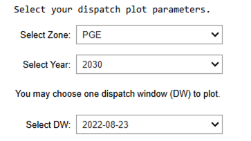

# RESOLVE Results Viewing

Note that for any pre-existing `RESOLVE` case results included in the `RESOLVE` package, there is no need to take these steps. You are advised to directly open the `Saved Case Results Viewer` folder to find the pre-loaded results viewer for each case.

Once RESOLVE is done solving your case, it will save a series of CSVs that summarize the portfolio investment and operational decisions. These files are stored in the run’s report folder, which is found in  
`./reports/resolve/[case name]/[timestamp]/`

Once you have a RESOLVE case run optimization completed, the output directory structure will look something similar to this after all case results are saved:


The output file size will also be dependent on the case settings and components. For example, including hourly results will increase the file size and number of outputs. As there is a large amount of information, it is not convenient to open each file and explore; thus, having a centralized result viewer becomes very important. The RESOLVE package comes with a readily available results viewer template to help modelers retrieve and summarize detailed case results. The results viewer is an Excel-based workbook that has inbuilt formulas and methods that digests the individual CSVs and provides comprehensive information on the entire system. Users can load specific case results into Results Viewer using an interactive Jupyter notebook script to aggregate annual results. An additional script is made available to aggregate hourly results which is totally optional and recommended if hourly data review is needed. Additionally, all publicly shared cases have pre-loaded case results that can be found in the `Saved Case Results Viewer` folder.

## Using the interactive Jupyter Notebook to Load Annual Case Results

Users can find a script called “RESOLVE_Annual_RV_Creation.py” within the `notebooks` directory of the repository. To use the script, activate your RESOLVE environment, then open the script from Jupyter Notebook or Jupyterhub. Note that the script is designed to work independently.

```{tip}
To open Jupyter Notebook, simply activate the environment from Pycharm terminal, then run `Jupyter Notebook` command and navigate to the `notebooks` folder to find the script.
```

As you run the first couple blocks of code, you will be asked to enter the file path of results folder and the Results Viewer Workbook itself, which will be a part of the package as well. Please note that any new case that you run, you should make sure the results are saved in the `reports` folder. This is what that selection process should look like:


The next block automatically identifies the components that are specific to the selected case, and shows the list of those components that are getting mapped to in the Results Viewer template you linked in the beginning. Additionally, standard sheet mapping is shown for user to optionally edit them if desires.


After that, the script shows full sheet mapping for review before loading all case results into the workbook.


Next, it starts to load the case results to the Results Viewer template and shows the progress as the picture below demonstrates. 


After this block completes the run, the users can find the Results Viewer saved in the same folder as the template Results Viewer was selected earlier. Note that this could be a computationally intense process and depending on the size of the case can take up to 30 minutes to load one case.

## Optional Hourly Results Processing Jupyter Notebook

In addition to viewing annual results, one may be interested in viewing and analyzing hourly model results. This is only possible if the “report_hourly_results” argument in the attributes.csv file for the case is set to TRUE at the time of setting up the case, which tells RESOLVE whether to save hourly results to the case reports folder. If hourly results are included in the case reports folder, you can analyze them with the “RESOLVE Hourly Results Viewer.py” Jupyter notebook within the `notebooks` directory of the resolve repository. In this case, make sure to open Jupyter Notebook after activating your environment.


The hourly results viewer notebook provides a workflow for analyzing and visualizing hourly and chronological dispatch results from RESOLVE model outputs. The user is guided to select a local directory containing RESOLVE case results and a destination folder for output via interactive file choosers. It is recommended that the case results be stored on a local drive rather than cloud to increase the speed of importing the results into the notebook. If you would like to aggregate certain resources into aggregate groups for analysis, the user can optionally select an Excel Results Viewer workbook, which should contain two named ranges on the `Results Groupings` worksheet: one for assigning resources to "Build Groups" and another for defining color settings and chart ordering for those groups. This setup enables streamlined downstream plotting of dispatch data either by grouped resource types or individual resources. The user then has the option to export hourly load-resource balance results (i.e., generation, load, zonal imports and exports, and battery charge and discharge results) for each specified zone and modeled year. Moreover, one can create hourly dispatch plots for a specified zone, model year and dispatch window (a.k.a. representative period) as shown with an example below.



For hourly dispatch charts, the resource aggregation and color coding is defined in the Excel Results Viewer workbook as a name range. The colors are set to match the annual results charts shown in the Excel Results Viewer workbook.


The resource grouping that is used for hourly results aggregation is also defined in the Excel Results Viewer workbook, as a name range. An example of that is provided below:


In addition to hourly dispatch chart, and in the last section of the script, there is a template to plot state of charge figures which are used to track storage resources with inter-day sharing feature. An example is provided below.

