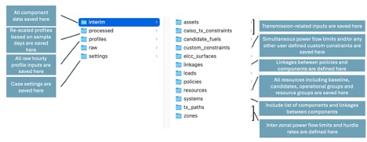

# Running RESOLVE

After saving your input data & case settings (refer below to see how this should look like) (as described in [Saving Input Data & Case Settings](https://docs.ethree.com/projects/resolve/en/latest/user_guide/index.html#saving-inputs)), you are now ready to run RESOLVE. Here is the file directory structure with the main folders that you interact with when running a RESOLVE case. The “data” folder then holds all input data such that:

The subfolders in the "data" folder include:

| Folder name | Description   |
|---------------------------------------------------|--------------------------------------------------------------------------------------------------------------------------------------------------------------------------------------------------------------------------------------------------------------------------------------------------|
| interim                                           | Includes all system data that gets saved from Scenario Tool via macro. Each folder saved data for a specific component type. The subfolders of “systems” and “linkages” share data regarding the relationship between components.                                                                |
| profiles                                          | Includes hourly profiles. Subfolders include different components of the system that require hourly profiles.                                                                                                                                                                                    |
| processed                                         | Includes re-scaled profiles from RESOLVE which gets created the first time running a RESOLVE case with all profiles and sample days.                                                                                                                                                             |
| settings                                          | Includes sample days in the “timeseries” subfolder and all case definitions in the “resolve” subfolder. The subfolder of “temporal_settings” is where modeling years and other temporal settings get saved.                                                                                      |

Similarly, the subfolders in the “results” folder include:

| Folder name | Description |
|-------------|-------------|
| Subfolders in “resolve” folder for each case name | Includes results of a case run. If a run is successful, the main results will be saved in the “summary” folder for the case. Results folder for a case will still be created if the run fails but no summary results will be available. The log file may help identify the case failure reason.  |

A schematic of the data folders is shown below:



## Running RESOLVE from the Command Line
If you plan to run Resolve via a command line/terminal, use the following instructions. Running Resolve via the command line gives you more options for how the model is run than are exposed in the Scenario Tool, as discussed below.

1. In a command line (e.g., Command Prompt), navigate into the ./new_modeling_toolkit/resolve directory
1. Activate resolve-env conda environment: ``` conda activate resolve-env ```
1. Use the command python run_opt.py to run a case. The run_opt.py script accepts the following arguments:
-  ```--data-folder```: The name of your data folder (if different than the default .\data)
-  ```--solver-name```: The name of the solver to use (e.g., gurobi, cplex, amplxpress, appsi_highs
- ```--symbolic-solver-labels```: Enable descriptive variable names in the Pyomo model formulation–helpful for debugging but not recommended to use as a default.

```{tip}
If for the installation process, you had used Pycharm or any other platforms, then the recommended best practice is to open a terminal from there and run the same commands.
```


### Examples:

- To run all cases listed in ./data/settings/resolve/cases_to_run.csv using gurobi as the solver:

```python run_opt.py --data-folder data --solver-name gurobi```

- To run a single defined case called Core_25MMT, type the name of the case into the command line:

```python run_opt.py Core_25MMT --data-folder data --solver-name gurobi```

- To run all cases from a different data folder called `data-new` (listed in `./data-new/settings/resolve/cases_to_run.csv`) using `cplex` solver:

```python run_opt.py Core_25MMT --data-folder data --solver-name cplex```


```{Note}
If you’re in your command line and unsure what arguments to pass to `run_opt.py`, use the command `python run_opt.py --help` to get help!
```