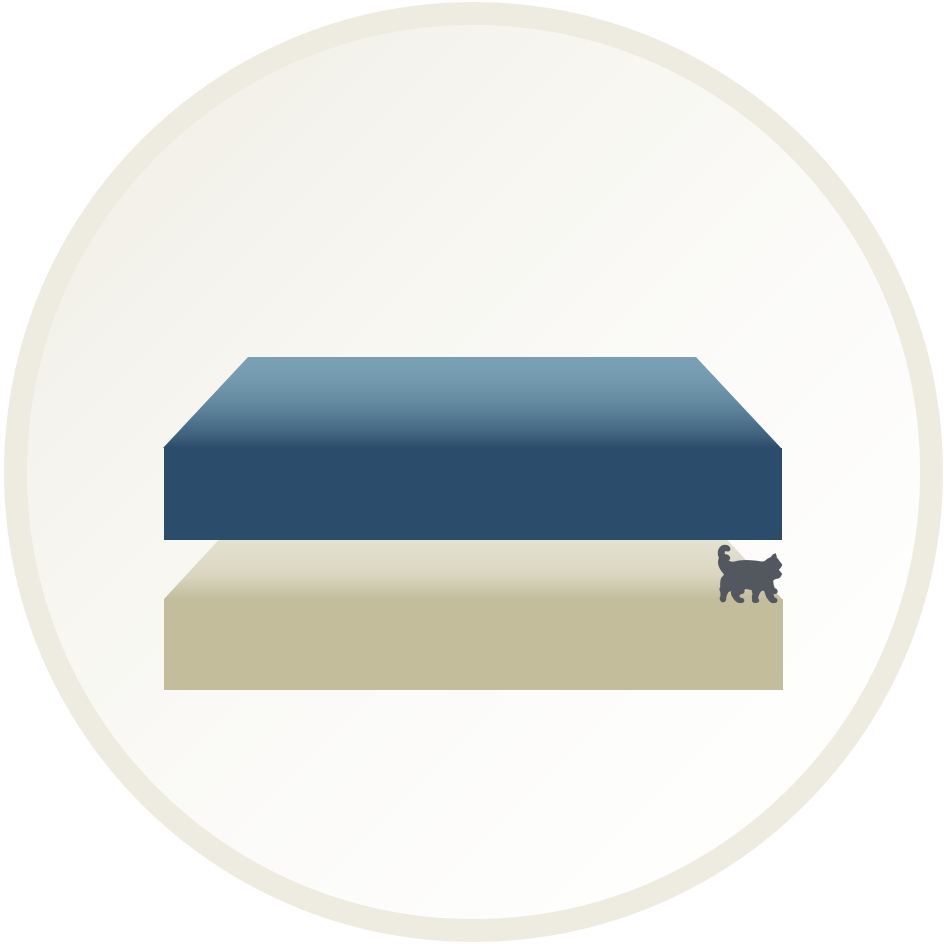
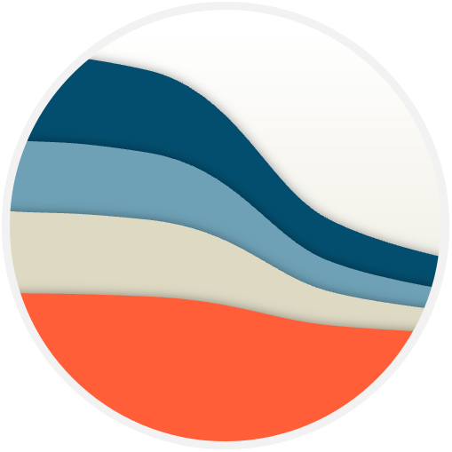
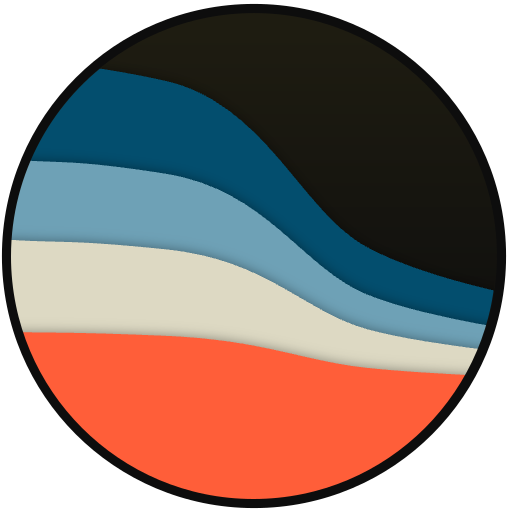
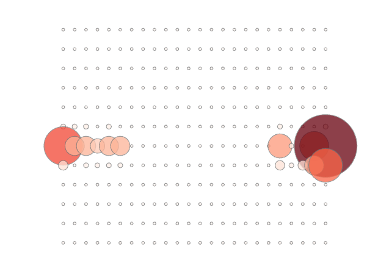
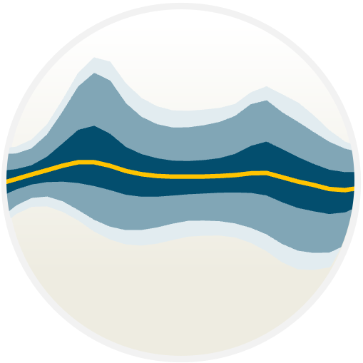
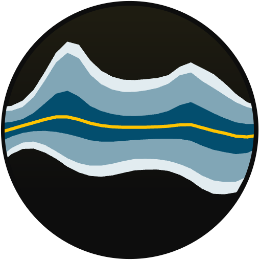
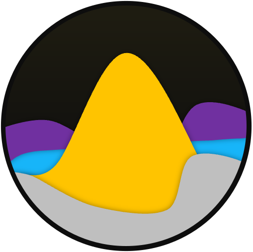

# E3 Tool Branding Guidelines

1. **Use Title Case (or lower case monospace) instead of ALL CAPS** (e.g., Resolve or `resolve` instead of RESOLVE)
2. **Our code we're building should be called “tools”, "platform", or "software". Do not call them "models".**
   "Models" are the representations of the systems we’re studying, and we use tools to build those models. This is
   similar to how a "**model** train" is a miniature, simplified version of an actual train.

## Logos

Logos for some of E3's tools can be found below:

|          | Light                                                            | Dark                                                           |
|----------|------------------------------------------------------------------|----------------------------------------------------------------|
| Kit      | {width=150px}           | {width=150px}           |
| Pathways | {width=150px} | {width=150px} |
| Recap    | {width=150px}             |                                                                |
| Reserve  | {width=150px}   | {width=150px}   |
| Resolve  | {width=150px}   | {width=150px}   |
