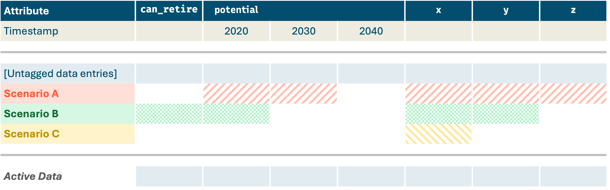
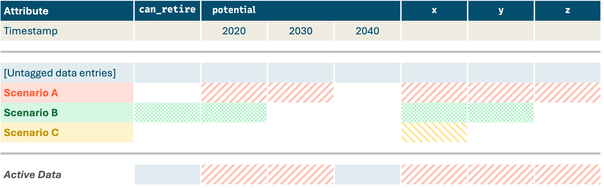
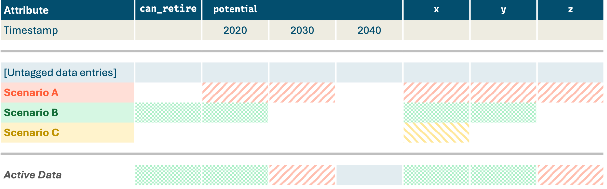
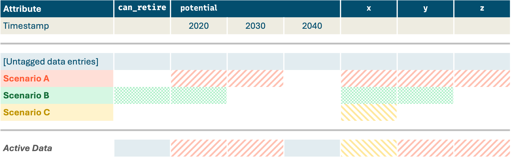

# Components

The `Component` class is designed to store structured data for a specific real "object" of "concept" in the system being
modeled. Components can take the form of generators, transmssion paths, policies, etc. Data is stored in specified
"attributes" for the Component.

## `Kit` CSV File Format

All `kit` components have a standard CSV file format. The behavior of how these CSV files are read in is described
below:

```{eval-rst}
.. automethod:: new_modeling_toolkit.core.component.Component.from_csv(filename)
   :no-index:
```

## Understanding the Scenario Tagging "Layer Cake"

::::{tab-set}

:::{tab-item} No Scenarios



If no scenarios are active in the model run, then only the untagged data (and any default data for attributes that
aren't specified in the CSV file) get used. All other data in the CSV file gets ignored.
:::

:::{tab-item} Scenario A



If **Scenario A** is active, then data tagged with that scenario (indicated as cells with red stripe shading) supersede
the untagged & default data. For example, the resource `potential` in 2020 & 2030 get overridden, as well as attributes
`x` and `y`.
:::

:::{tab-item} Scenarios A + B



The layer cake continues with additional scenarios...
:::

:::{tab-item} Scenarios A + C



The layer cake continues with additional scenarios...
:::

::::

```{warning}
There is currently one exception to the "layer cake" analogy above. If **timeseries data** is input in the CSV file as a 
filepath to another CSV file, then **no data from previous layers** of the scenario tagging layer cake will be used 
(i.e., only the data from the other timeseries CSV file will be considered). 
```