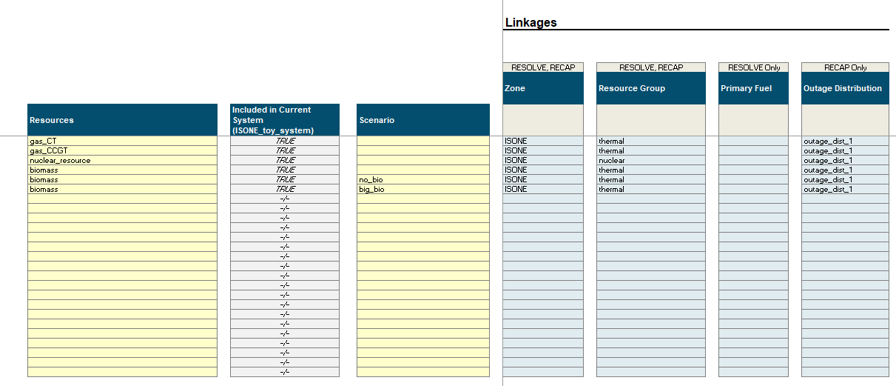

# Linkages

Linkages serve two purposes:

1. To connect two `Components` together
2. To store data related to the linked components (e.g., the `ZoneToTransmissionPath` linkage holds information about
   which zone is the `from_zone` and which is the `to_zone`)

```{hint}
For folks familiar with databases, you can think of linkages as "foreign keys".
```

Linkages are defined within each of the component tabs in the UI. They are specified individually for each component and
is defined in the first few columns of each component. Below is an example of where linkages are in the UI

Example of select `ThermalResource` linkages in the Thermal Tab in the UI.


## Linkage CSV File Format

Linkage input CSVs follow a slightly modified version of the `attributes.csv` file format discussed on the
[`Components`](components.md) page. In particular, individual "instances" of linkages are not separated into separate
CSV files but are instead grouped together under the same CSV file under the corresponding `data/system`
subfolder. As such, individual linkages are identified via additional columns in the CSV file:

| component_from            | component_to              | timestamp                            | attribute                        | value   | scenario tag (optional) | 
|---------------------------|---------------------------|--------------------------------------|----------------------------------|---------|-------------------------|
| [component instance name] | [component instance name] | [None or timestamp (hour beginning)] | [attribute name defined in code] | [value] | [scenario name]         |

Otherwise, timeseries data, units, and scenario tagging behave the same way as Component `attributes.csv` files.

## Special Cases

### Threeway Relationships

#### PRM → Resource → ELCC

Three-way relationships (e.g., PRM → Resource → ELCC) must be defined as multiple linkages (e.g., PRM → Resource,
Resource → ELCC, ELCC → PRM) to capture all the requisite information.

#### Resource → Candidate Fuel → Emissions
