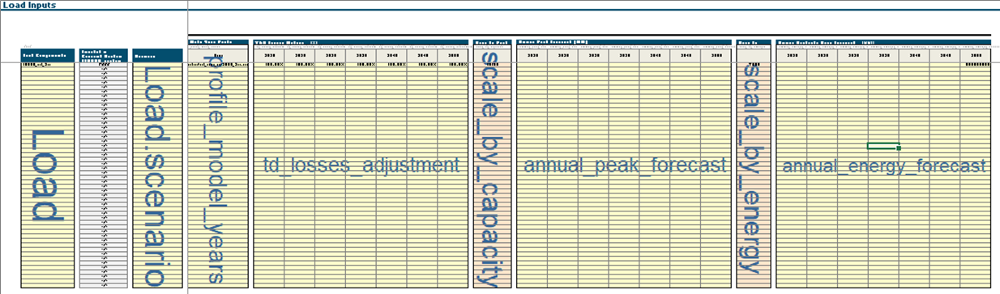
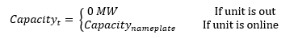
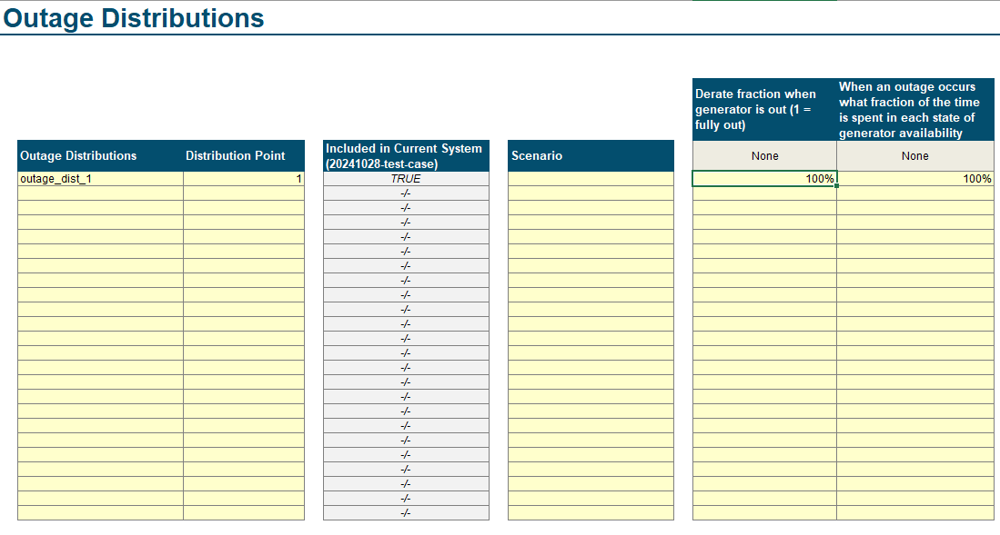
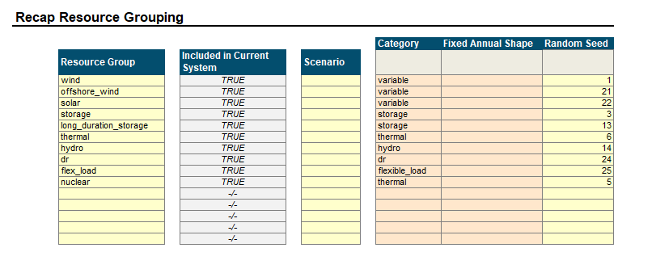
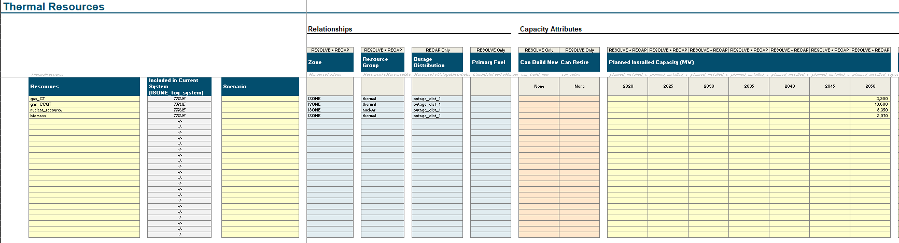
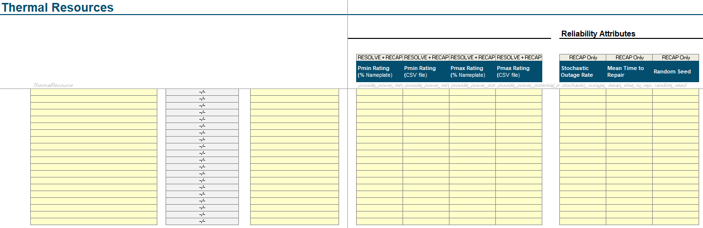
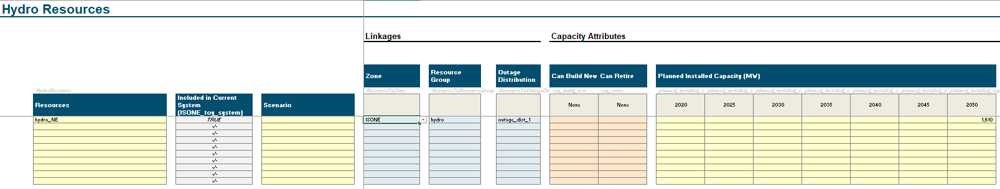
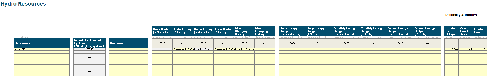
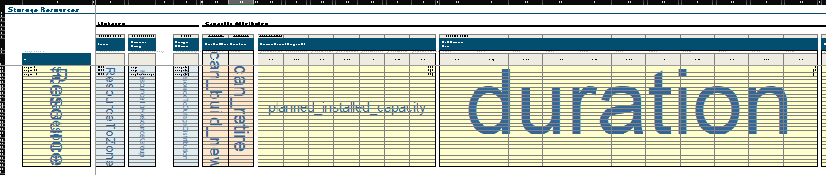
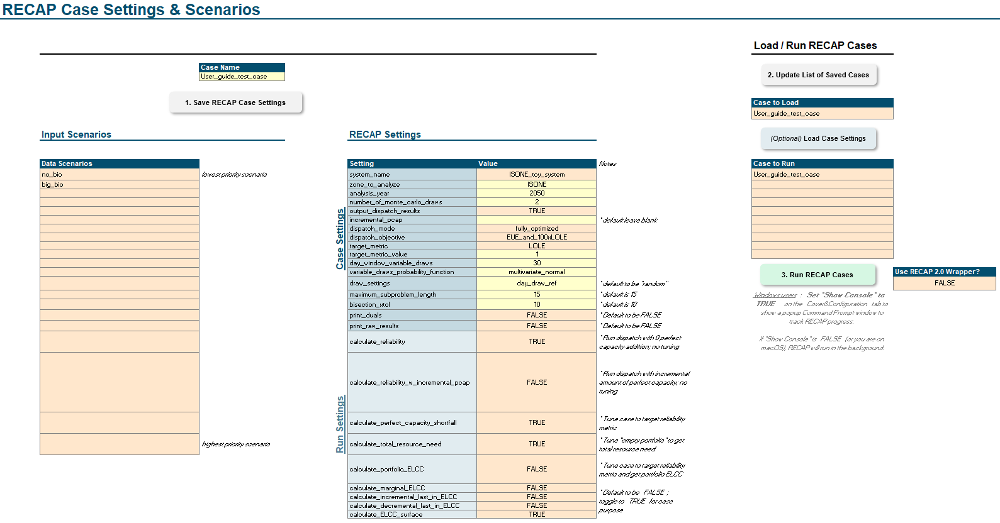

# 📊 1. Inputting Data

```{article-info}
:date: Oct 23, 2024
:read-time: 60 min read
:class-container: sd-p-2 sd-outline-muted sd-rounded-1
```

## How is data represented and how to add Data to RECAP

This section describes the data inputs to RECAP and walks through how to add data into RECAP. This section is laid out in the following:
1. Basic Folder Structure
2. Components (Load, Resources, Etc.)
3. System
4. Settings


:::::{dropdown} 1. Basic Folder Structure
## Basic Folder Structure
Once you open the kit folder, users will find the folders and files as shown below. While there are more files and folders in kit, the bolded ones are the ones users should get to know.


Here is a quick description of each of the important folders and files. 
#### 1. folder: new-modeling-toolkit
This is where all the code lives and the majority of users will not interact with this file. 

#### 2. folder: reports
This is where all the model will write out results data files (mainly CSVs). 
Most users will not directly open files in this folder and use the next folder - Notebooks. 
Advanced users are welcome to explore the folder structure of results to better understand how RECAP writes out results.

#### 3. folder: notebooks
This is where users will find RECAP's main inputs and results analyzer. This tool will be discussed in length in the "2. Checking Inputs" and in "4. Analyzing Results"

#### 4. folder: logs
This is useful for users to debug results, but not much interaction will be required for many users.

#### 5. folder: data
This is where all the inputs for RECAP located. Most of the data files here are generated by Scenario Tool and some will be manually inputted by users. 
Of all the folders, users will interact with this one the most and this guide will explain how to add data in the next section.

#### 6. folder: data-test
This folder contains a toy model that is used for training and homeworks. This is where new users will learn how to use RECAP. This has the same folder structure as the data folder

#### 7. file: recap-resolve scenario tool
This Excel Macro Workbook is the main way users will interact with RECAP and will serve as the User Interface that creates cases. Note: Results will NOT be viewed in this file. See Section "4. Analzying Results"  

#### 8. environment.yml
This is the main file used to set users' computers up with the right modeling environment. See "0. Getting Started" for more details.
:::::


:::::{dropdown} 2. Components
Components is a generic term for all the different parts of the energy system. Below is a subset of all the components of RECAP to help build intuition of what we mean by "component" and what is in the toy case.

| Components         | Definition                                                              | Example in Test Case |
| ------------------ | ----------------------------------------------------------------------- | -------------------- |
| Load               | Annual energy + peak load for each component in each zone in system     | ISONE_load_2yr       |
| Reserve            | Reserve components in system                                            | regulating_up        |
| OutageDistribution | Outages associated with Resources                                       | outage_dist_1        |
| Zone               | Zones within the system                                                 | ISONE                |
| ThermalResource    | Thermal resources in the system                                         | gas_CT               |
| HydroResource      | Hydro resources in the system                                           | hydro                |
| VariableResource   | Variable (like solar, wind, run-of-river, etc.) resources in the system | Solar                |
| StorageResource    | Storage resources in the system                                         | storage_4hr          |
| ShedDrResource     | Demand Response resources in the system                                 | shed_dr              |
| FlexLoadResource   | Flexible Load resources in the system                                   | flex_load            |


::::{dropdown} A. Load

#### Informational: Load

There are two types of load data needed: 
1.  **Hourly load profiles**: an hourly data set, representing multiple weathers years. (e.g. 40 weather years representing 2024)
2. **Annual peak and/or energy forecast**: an annual dataset, used to scale the hourly load profiles to a target study year (e.g. 2025-2050 peak load forecast).

How do they work together? The **_hourly load profiles_** are scaled by the **_annual load forecast_** to the modeling year of interest. 
The model will scale up the NN load profile using linear scaling algorithms:

1. Scale to energy only
2. Scale to peak only
3. Scale to both peak and energy


##### How-to: Adding Load into the Scenario Tool?
Steps to input annual load forecast
1. Within the Scenario Tool, go to the `Loads` tab. 
2. Moving left to right on the layout, **define the name of the load component** (e.g, `base_load`, `electric_vehicle`). 
   3. _Best Practice_: do not leave spaces and using `_` or `-`.
3. (optional) **Add a scenario tag**. If base scenario, no scenario tag is required.
4. (optional) **Specify a T&D loss adjustment**. This is a multiplier on the load component itself,  (e.g 107% of `base_load`).
5. **Add in annual peak, energy, and/or both forecasts** for the future years. 
6. Finally, specific `TRUE` or `FALSE` on which component is scaled by which forecast. 

Within the `load` tab of the Tool, this is what the layout looks like. 

::::

::::{dropdown} B. Reserves

#### Informational: Reserves

In RECAP, Reserves are represented in 3 ways:
1. Total MW amount held across every hour (e.g. +300MW per hour), 
2. Percentage of hourly load  (e.g. 3% above hourly load),
3. Profile that temporally matches the load components.

What kinds of Reserves should we model?

| Reserves                 | Description                                    | Example Quantities             | Recommended to be modeled in RECAP | Comments                                                                                                                               |
| ------------------------ | ---------------------------------------------- | ------------------------------ |------------------------------------|----------------------------------------------------------------------------------------------------------------------------------------|
| Non-Spinning Reserves    | Uncertainty in load and generator availability | 3% of load                     | No                                 | Excluded by most utilities in LOLP studies; likely depleted before shedding firm load                                                  |
| Spinning Reserves        | Uncertainty in load and generator availability | 3% of load                     | Yes                                | Included by most utilities in LOLP studies; required by NERC                                                                           |
| Ramping / Load Following | Intra-hour deviations                          | Varies by conditions on system | No                                 | Not considered by most utilities in LOLP studies; since most EUE events will be after sunset, this component should also be negligible |
| Regulating Up            | Intra-5-minute deviations                      | 1.5% of load                   | Yes                                | Included by most utilities in LOLP studies; required by NERC (this differs from the approach taken so far)                             |
| Regulating Down          | Intra-5-minute deviations                      | 1.5% of load                   | No                                 | Excluded by most utilities in LOLP studies; rarely affects peak period operations                                                      |
| Frequency Response       | Sub-minute deviations                          | 30 MW                          | Likely Yes                         | Included as some utilities in LOLP study as a common practice for internal operations                                                  |


##### How-to: Adding Reserves into the Scenario Tool?
1. Within the Scenario Tool, go to the `Operating Reserves` tab. 
2. Moving left to right on the layout, **define the name of the reserve component** (e.g, `regulating_up`, `spinning`). 
   3. _Best Practice_: do not leave spaces and using `_` or `-`.
3. (optional) **Add a scenario tag**. If base scenario, no scenario tag is required.
4. **Specify the reserve in the `up` direction**. This should always be `up` in RECAP.
5. **Do not use the `Unserved Reserve Penalty` as RECAP does not use that.
5. **Add in hourly reserve requirement** 3 ways:
   * Flat requirement for all future years. 
   *  If using % of hourly load, specify the zone and % mulitplier below the years

::::

::::{dropdown} C. OutageDistribution

#### Informational: Outage Distribution

In RECAP, OutageDistribution is represented by specifying the setpoints of the derate as a % of total MW and the probability of the different setpoints.
Outage distribution functions are used to simulate the distribution of full or partial outages. Mean time to repair characterizes the duration of outages. 
Outages are generated independently for each resource, then summed. 

OutageDistribution represents the possible outage “states” for a power plant. Since RECAP models individual units at a time, this has traditionally  been modeled as either “fully online” or “fully out”. 



However, in the rare times that a distribution is specified, RECAP is able to set specific setpoints during which a plant could be partially out.

##### How-to: Adding Outage Distribution into the Scenario Tool?
1. Within the Scenario Tool, go to the `Outage Distributions` tab. 
2. Moving left to right on the layout, **define the name of the outage distribution component** (e.g, `full_outage`, `outage_dist_1`). 
   3. _Best Practice_: do not leave spaces and using `_` or `-`.
3. (optional) **Add a scenario tag**. If base scenario, no scenario tag is required.
4. **Specify the reserve in the `up` direction**. This should always be `up` in RECAP.
5. In "Derate fraction when generator is out (1 = fully out)" column, specify the level of outage as a percent of nameplate
6. In "When an outage occurs what fraction of the time is spent in each state of generator availability", specify the 




::::


::::{dropdown} D. Resources

#### Informational: Resources
To understand how resources are dispatched in RECAP, please see the  (`resources ) section in our documentation here
[Resource Informational Documentation](..\system\electric\resources\index.md).

#### How-to: Adding Resources

:::{dropdown} 1. Resource Group Set up:

##### 1. Resource Group Set up:



1. In the `Resources →` tab 
   1. Define all Resource Groups expected in the system.
   2. (optional) Define a scenario for each resource type, if needed
   3. From a dropdown list, assign one of 9 resource `Category`. 
      1. If a resource has a fixed annual shape, excluding weather-dependent resources, please specify.
   4. Assign a random seed to each group
:::

:::{dropdown} 2. Adding Thermal Resources

#### How-to: Adding A Thermal Unit
1. Within the Scenario Tool, go to the `Thermal` tab. 
   1. _Note, there are some columns are are not required for RECAP users. Please only interact with the columns that say `RECAP only` or `RESOLVE+RECAP`_
2. Moving left to right on the layout, **define the name of the resource** (e.g, `gas_ct_unit_1`, `nuclear_unit_4`). 
   3. _Best Practice: do not leave spaces and using `_` or `-`._
3. (optional) Add a scenario tag. If base scenario, no scenario tag is required.
4. Specify the zone of the resource
   1. _for RECAP, since it is a single zone model, all resources should be in the same zone._
5. Specify the Resource Group
6. Specify the Outage Distribution
5. In the `Planned Installed Capacity (MW)` columns, add in each unit's modeled capacity. To specify monthly derates for seasonal capacity, see step 6.
6. In the `Pmin Rating` and `Pmax Rating` columns, either:
   1. specify a static minimum or maximum percent relative to the `Planned Installed Capacity (MW)`, or
   2. specify a CSV of minimum or maximum rating as a timeseries. See this link on how to set up a timeseries file.
      3. Note: this is useful to help specify any seasonal derates for thermal resources.
7. In `Stochastic Outage Rate`, add the outage factor as a percent. See OutageDistribution for more information on what this represents
8. In `Mean Time to Repair`, add the hours of expected outage per outage event. 
9. Assign a `Random Seed`. This ensures each unit has its own outage profile. For connected (or correlated) outages, one can assign the same random seed across different units.




:::


:::{dropdown} 3. Adding Variable Resources

#### How-to: Adding A Variable Unit
1. Within the Scenario Tool, go to the `Variable` tab. 
   1. _Note, there are some columns are are not required for RECAP users. Please only interact with the columns that say `RECAP only` or `RESOLVE+RECAP`_
2. Moving left to right on the layout, **define the name of the resource** (e.g, `gas_ct_unit_1`, `nuclear_unit_4`). 
   3. _Best Practice: do not leave spaces and using `_` or `-`._
3. (optional) Add a scenario tag. If base scenario, no scenario tag is required.
4. Specify the zone of the resource
   1. _for RECAP, since it is a single zone model, all resources should be in the same zone._
5. Specify the Resource Group
6. Specify the Outage Distribution
5. In the `Planned Installed Capacity (MW)` columns, add in each unit's modeled capacity for each year.
6. In the `Pmin Rating` and `Pmax Rating` columns, either:
   1. specify a static minimum or maximum percent relative to the `Planned Installed Capacity (MW)`, or
   2. specify a CSV of minimum or maximum rating as a timeseries. See this link on how to set up a timeseries file.
      3. Note: this is useful for any resources like solar and wind to pass a multi-year hourly generation profile. Please note that the profile is directly multiplied by the `Planned Installed Capacity` in the specific study year.
7. In `Stochastic Outage Rate`, add the outage factor as a percent. See OutageDistribution for more information on what this represents
8. In `Mean Time to Repair`, add the hours of expected outage per outage event. 
9. Assign a `Random Seed`. This ensures each unit has its own outage profile. For connected (or correlated) outages, one can assign the same random seed across different units.
:::


:::{dropdown} 4. Adding Hydro Resources

#### How-to: Adding A Hydro Unit
1. Within the Scenario Tool, go to the `Hydro` tab. 
   1. _Note, there are some columns are are not required for RECAP users. Please only interact with the columns that say `RECAP only` or `RESOLVE+RECAP`_
2. Moving left to right on the layout, **define the name of the resource** (e.g, `gas_ct_unit_1`, `nuclear_unit_4`). 
   3. _Best Practice: do not leave spaces and using `_` or `-`._
3. (optional) Add a scenario tag. If base scenario, no scenario tag is required.
4. Specify the zone of the resource
   1. _for RECAP, since it is a single zone model, all resources should be in the same zone._
5. Specify the Resource Group
6. Specify the Outage Distribution
5. In the `Planned Installed Capacity (MW)` columns, add in each unit's modeled capacity for each year.
6. In the `Pmin Rating` and `Pmax Rating` columns, either:
   1. specify a static minimum or maximum percent relative to the `Planned Installed Capacity (MW)`, or
   2. specify a CSV of minimum or maximum rating as a timeseries. See this link on how to set up a timeseries file.
7. In the `Energy Budget` columns, one can specify energy budgets in:
   1. Each day of the year - single or multiple years with energy budgets for each day of the year
   2. Each month of the year - single or multiple years with energy budgets for each month of the year
   3. Each year - single or multiple years with energy budgets for each year
8. In `Stochastic Outage Rate`, add the outage factor as a percent. See OutageDistribution for more information on what this represents
9. In `Mean Time to Repair`, add the hours of expected outage per outage event. 
10. Assign a `Random Seed`. This ensures each unit has its own outage profile. For connected (or correlated) outages, one can assign the same random seed across different units. 





:::

:::{dropdown} 5. Adding Storage Resources

#### How-to: Adding A Storage Unit
1. Within the Scenario Tool, go to the `Storage` tab. 
   1. _Note, there are some columns are are not required for RECAP users. Please only interact with the columns that say `RECAP only` or `RESOLVE+RECAP`_
2. Moving left to right on the layout, **define the name of the resource** (e.g, `gas_ct_unit_1`, `nuclear_unit_4`). 
   3. _Best Practice: do not leave spaces and using `_` or `-`._
3. (optional) Add a scenario tag. If base scenario, no scenario tag is required.
4. Specify the zone of the resource
   1. _for RECAP, since it is a single zone model, all resources should be in the same zone._
5. Specify the Resource Group.
6. Specify the Outage Distribution.
5. In the `Planned Installed Capacity (MW)` columns, add in each unit's modeled capacity for each year.` 
6. For Energy Capacity, one can specify the energy capacity using the `Fixed Duration (hour)` column
   1. this acts as a multiplier relative to the nameplate capacity (e.g. 100Mw @ 4hours = 400MWh)
   2. Note, the `Planned Storage Capacity (MWh)` is purely informational, please do not use this attribute. 
7. Specify the `Charging Efficiency (%)` and `Discharging Efficiency (%)`.
8. Specify the `Parasitic Loss (% SoC/hour)`. 
9. Specify the `Pmin Rating` either as  a % of Nameplate or a CSV file





:::

:::{dropdown} 6. Adding Shed Demand Response and Flex Load Resources

#### How-to: Adding A Shed DR Program
1. Within the Scenario Tool, go to the `Shed DR` tab. 
   1. _Note, there are some columns are are not required for RECAP users. Please only interact with the columns that say `RECAP only` or `RESOLVE+RECAP`_
2. Moving left to right on the layout, **define the name of the resource** (e.g, `dr_program_1`). 
   3. _Best Practice: do not leave spaces and using `_` or `-`._
3. (optional) Add a scenario tag. If base scenario, no scenario tag is required.
4. Specify the zone of the resource
   1. _for RECAP, since it is a single zone model, all resources should be in the same zone._
5. Specify the Resource Group.
6. Specify the Outage Distribution, if any.
5. In the `Planned Installed Capacity (MW)` columns, add in each program's modeled capacity for each year.` 
6. For `Shed Profile`, one can specify the hourly availability as either a % of total nameplate or in MW column
7. If Shed Profile isn't used, one can specift the total number of calls per:
   * Day,
   * Month, or 
   * Year
10. Specify `Call Duration (hr)` for  the length of each call for each program
11. (Optional) Specify `Min Down Time (hr)` and `Min Up Time (hr)` to limit consecutive calls
12. (Optional) One can specify a DR program's `Energy Budget` by:
    * Day
    * Month, or 
    * Year


:::

::::

:::::

:::::{dropdown} 3. System

Once you've defined your components, you can use the `System` tab to create variations of your system. In the layout below you have to ensure the following:
1. Every component that a user wants defined in a system must be present in the `System Configuration` table
2. Once all components are in the `System Configuration` table, name the system (e.g. preferred_system_plan), click button #1
3. Then click button #2 to save all components for RECAP

::::{dropdown} Why do we need to define a System?
This step is useful when you have many different systems to test. This is useful for systems that may be completely different from each other but want to use the RECAP as a model. For example, Hawaiian Electric has 5 independent island grids and all can live within this one UI as differently defined systems. Similarly, All Xcel system (CO, MN, SPS, etc.) can all be defined in one UI, but run independently  

::::


:::::


:::::{dropdown} 4. Case Settings

# `Settings`

Settings are the final step to completing any Kit model

## Recap

For `RecapCase`, once you’ve completed defining your system, settings tell Recap what specific results to provide you.
In Recap 3.0, we’ve transitioned to thinking about using Recap for different Use Cases. See Table below as an example of
how to use the run settings to your advantage for each project use case.

### Case settings

| Case Setting                        | Definition                                                                                                      | Input Type          | Example in Test Case |
|-------------------------------------|-----------------------------------------------------------------------------------------------------------------|---------------------|----------------------|
| zone_to_analyze                     | Study zone                                                                                                      | string              | CAISO                |
| analysis_year                       | Users set the modeling year, sets value for loads and   portfolio                                               | int                 | 2030                 |
| number_of_monte_carlo_draws         | Users define total number of MC draws                                                                           | int                 | 1                    |
| output_dispatch_results             | If TRUE, Recap outputs hourly dispatch for all MC draws                                                         | TRUE/FALSE          | TRUE                 |
| base_case_capacity_shortfall        | Users can pre-seed capacity shortfall to reduce tuning in   optimization                                        | float or empty      |                      |
| dispatch_objective                  | Must be equal to target_metric_value minimize EUE or LOLE   in objective function                               | EUE/LOLE            | LOLE                 |
| target_metric                       | Must be equal to target_metric, EUE or LOLE target?                                                             | EUE/LOLE            | LOLE                 |
| target_metric_value                 | EUE or LOLE target value                                                                                        | float               | 0.1                  |
| day_window_variable_draws           | ???                                                                                                             | int                 | 30                   |
| variable_draws_probability_function | Users define how renewable days are drawn/scrambled                                                             | multivariate_normal | multivariate_normal  |
| draw_settings                       | Users either set this to "random' to create new day   draws, or tie day draws to a specific results folder name | string              | Base_Case            |

For the rest of the case settings, these help define the parameter of your Recap model run. This is where you set model
year, number of MC draws, zones to include, reliability metrics, and all the other settings that define your Recap case.
If you do not know what each setting does, ask your Tech Lead. It is imperative to look through these settings and know
what they do. Below are tables (Table 3.18 and Table 3.19) that describes the various settings

### Run settings

| Run Setting                          | Definition                                                                                                | What results do I get?                                              | Input Type |
|--------------------------------------|-----------------------------------------------------------------------------------------------------------|---------------------------------------------------------------------|------------|
| calculate_reliability                | Runs optimization or heuristic dispatch only, calculates   reliability                                    | Reliability results of the portfolio                                | TRUE/FALSE |
| calculate_perfect_capacity_shortfall | Runs optimization or heuristic dispatch and tunes,   calculates capacity shortfall                        | Capacity shortfall of the system based on reliability   target      | TRUE/FALSE |
| calculate_portfolio_ELCC             | Runs optimization or heuristic dispatch and tunes,   calculates portfolio ELCC                            | Portfolio ELCC relative to reliability target                       | TRUE/FALSE |
| calculate_marginal_ELCC              | Runs optimization or heuristic dispatch and tunes,   calculates portfolio ELCC relative to base portfolio | Marginal ELCC value of specific resources of the same MW   size     | TRUE/FALSE |
| calculate_incremental_last_in_ELCC   | Runs optimization or heuristic dispatch and tunes,   calculates portfolio ELCC relative to base portfolio | Marginal ELCC value of specific resources as defined in   portfolio | TRUE/FALSE |
| calculate_decremental_last_in_ELCC   | Runs optimization or heuristic dispatch and tunes,   calculates portfolio ELCC relative to base portfolio | Marginal ELCC value of specific resources as defined in   portfolio | TRUE/FALSE |
| calculate_ELCC_surface               | Runs optimization or heuristic dispatch and tunes,   calculates portfolio ELCC relative to base portfolio | ELCC value of a set of runs                                         | TRUE/FALSE |

### Recap case settings tab in the UI



```{note}
TODO (Docs): Describe special cases for data inputs (e.g., components.csv, linkages.csv, linkage attributes.csv, ELCC nested files)
```

:::::
