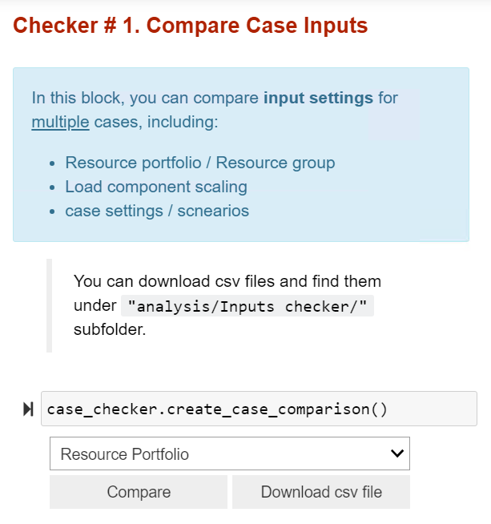
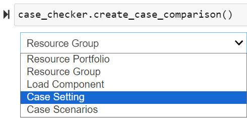
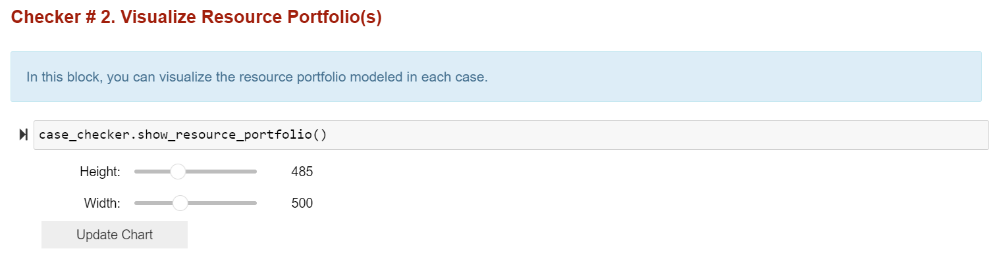
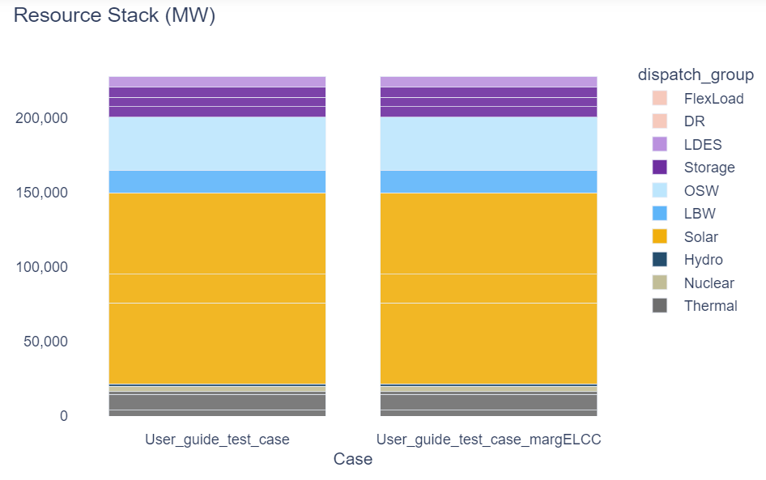
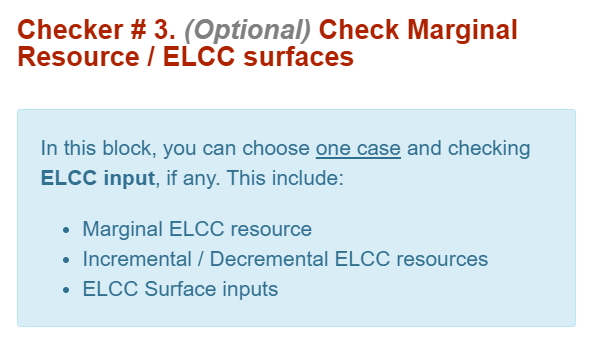
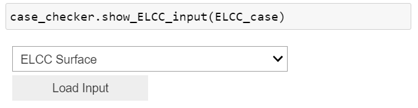
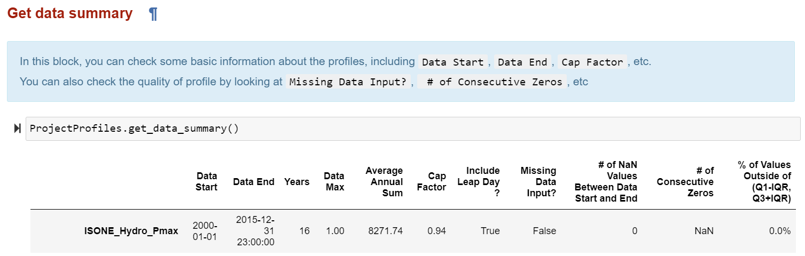
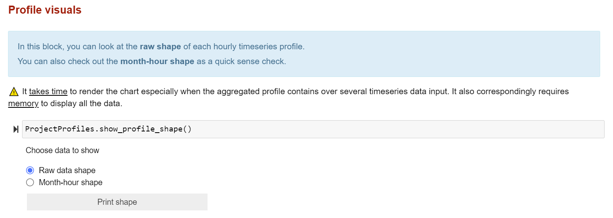
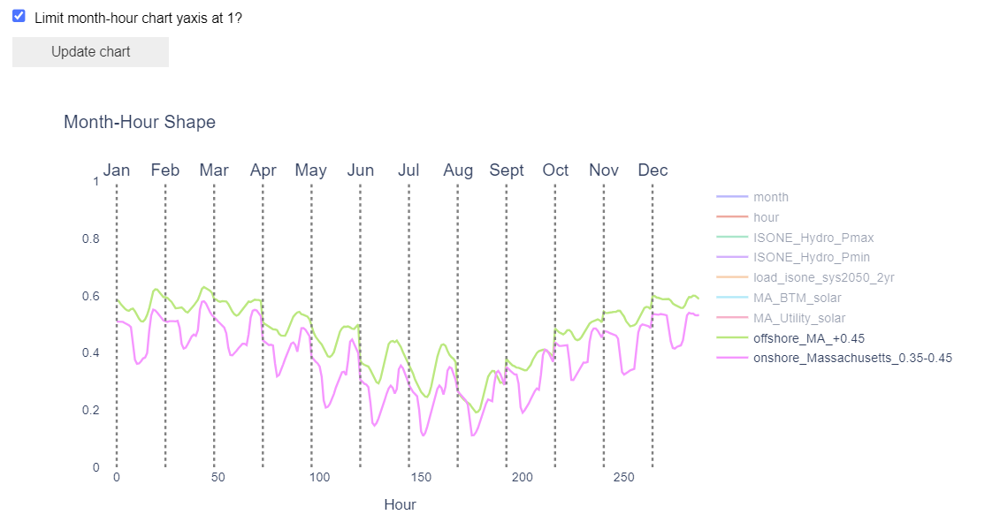

# 📊 2. Checking Model Inputs 

```{article-info}
:date: Sept 15, 2023
:read-time: 20 min read
:class-container: sd-p-2 sd-outline-muted sd-rounded-1
```

## How to check inputs (and why you should)

Running common analyses performed both prior to Recap runs saves time and checks over potential mistakes in `RecapCase`
setup - **and** we have a dashboard tool to help you do that!

:::{card} 📢 <font color='#55C0CF'>Recap Analytical Tool</font>
:class-title: sd-fs-5

The Recap Analytical Tool is an **interactive Jupyter Notebook** with built-in browser controls, where analysts can
visualize and manipulate charts / data to conduct basic input checking and results inspection.
<br>

The <font color='#034E6E'>**Case Input Checker**</font> section is designed to check case inputs.
<br>


The <font color='#034E6E'>**Kit Input Profiles Checker**</font> section is designed to QC model profile inputs.
<br>


+++

- The dashboard `“Recap Analytical Tool.ipynb”` can be found under the `"kit/notebooks/"` directory.
- Starting from scratch? First complete the <font color='#034E6E'>Environment Setup</font> section of
  the [Quick Start Guide](Quick%20Start%20Guide.md) page.
  :::

## Case Input Checker

As stated in the [Quick Start Guide](Quick%20Start%20Guide.md), being able to compare case calculation settings,
resource portfolio, and scenario inputs, etc., is an important step before running a case.

While *kdiffing* raw input files can be helpful, users are encouraged to make use of the Analysis Tool to load and
compare multiple case settings. There are **three checkers** available in the dashboard, you can display various input
information to confirm cases are set up appropriately by controlling the dropdown list in each subsection.

> 💬 This page will illustrate part of analysis contained in the dashboard, but it is <u>NOT</u> a step-by-step guide.
> You may find more practical instructions within the dashboard itself.
<br>

:::::{dropdown} Checker # 1. Compare Case Inputs
:class-title: sd-fs-6

::::{grid} 2
:gutter: 1

:::{grid-item-card}


*Example dropdowns:*


:::
:::{grid-item-card} **Common checklist for you:**

- **Case Settings:**
    - Is your System correct?
    - Is your modeling year correct?
    - Do you have enough Monte Carlo draws?
    - Did you want to output dispatch results?
    - Did you need optimized or heuristic dispatch?
    - Is your reliability target correct?
    - Do you need new day draws?
    - Did you select the correct run settings?
      <br>

- **Resource Portfolio**
    - Do you have the correct capacity mix for your portfolio?
      <br>

- **Load Component**
    - Are you scaling the loads correctly?
    - Do you have all the load components?
    - Are they right magnitude for each load component?
      <br>

- **Scenarios**
    - Did you include the all the scenarios?
    - Did you make sure the scenarios are hierarchically correct?

:::

::::

:::::

:::::{dropdown} Checker # 2. Visualize Resource Portfolio(s)
:class-title: sd-fs-6


*Example output:*

  
:::::

:::::{dropdown} Checker # 3. {bdg-info-line}`Optional` Check Marginal Resource / ELCC surfaces
:class-title: sd-fs-6

::::{grid} 2
:gutter: 1

:::{grid-item-card}

  


:::
:::{grid-item-card} **Common checklist for you:**

- Is my base portfolio correct?
- Do I have the correct run setting(s) toggled?
- Do I also want to report base case capacity short result? If so, do I have the corresponding run setting toggled?
- Does my ELCC surface look correct?
- Do I have the correct "incremental" toggle?
- Do I have the correct scenario?
- Do I need dispatch results?

:::

::::

:::::

<br>

## Kit Input Profiles Checker

In addition to the Recap case settings, you should also ensure that the timeseries profiles are high quality enough for
Recap runs. In this section, you can perform such quality check by looking at both profile summary stats and raw shapes.

::::{dropdown} View Data Summary Stats
:class-title: sd-fs-6

:::{grid-item-card}

:::

:::{grid-item-card} **Common checklist for you:**

- **For each profile:**
    - What year(s) are covered?
    - For each year, is each of the years(s) complete?
    - What time zone is used?
    - Are there missing data or NaNs?
    - What’s the longest period of consecutive zeros?
    - Is the data in standard or prevailing time?
    - Do the capacity factors make sense?
    - Is an “hour beginning” or “hour ending” convention used?
    - Are leap days (2/29) included?
    - Did you use the E3 timeseries data labeling convention when processing this data?
      <br>

- **Across profiles:**
    - Are the profiles in the same ResourceGroup of the same length?
      :::
      ::::

:::::{dropdown} Profile visuals
:class-title: sd-fs-6



*Example output:*



:::::


