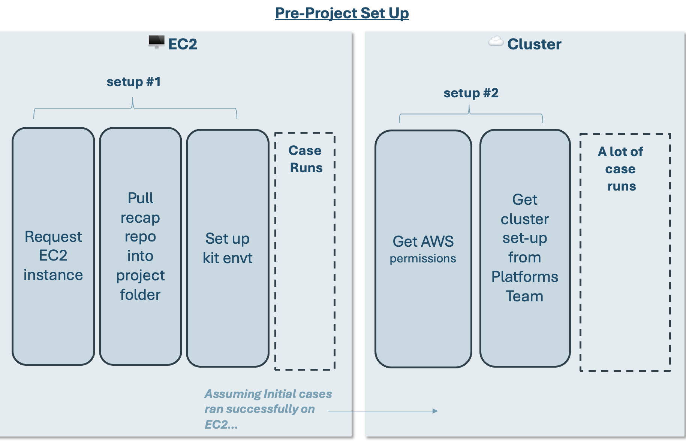
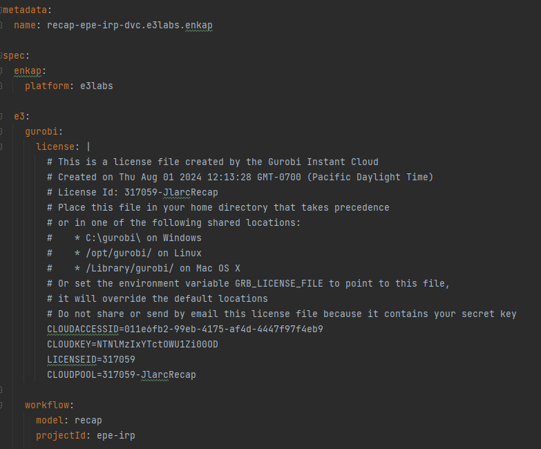
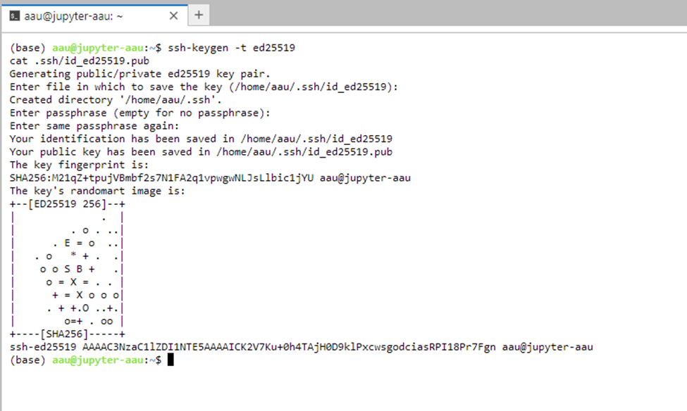
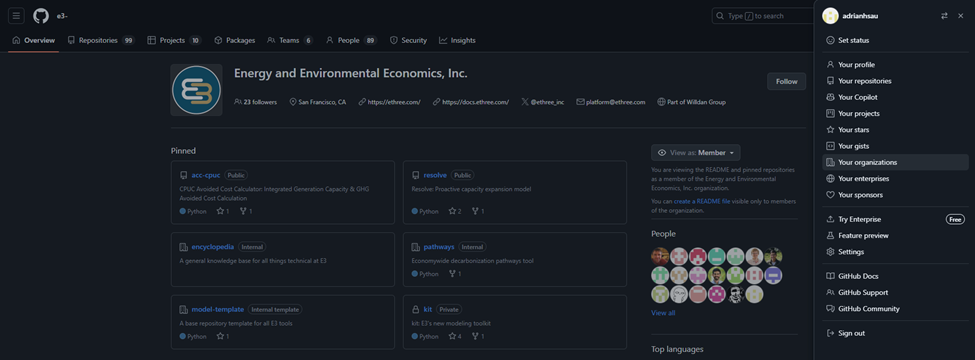
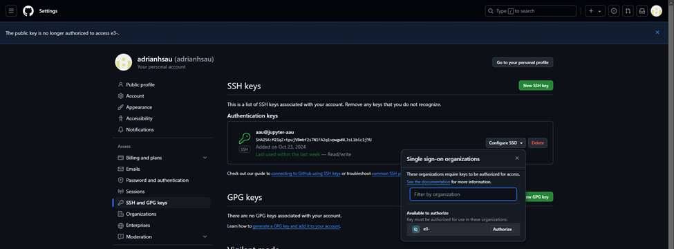
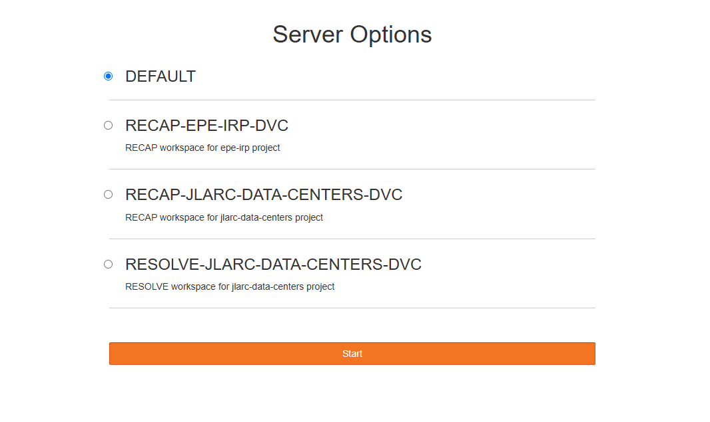
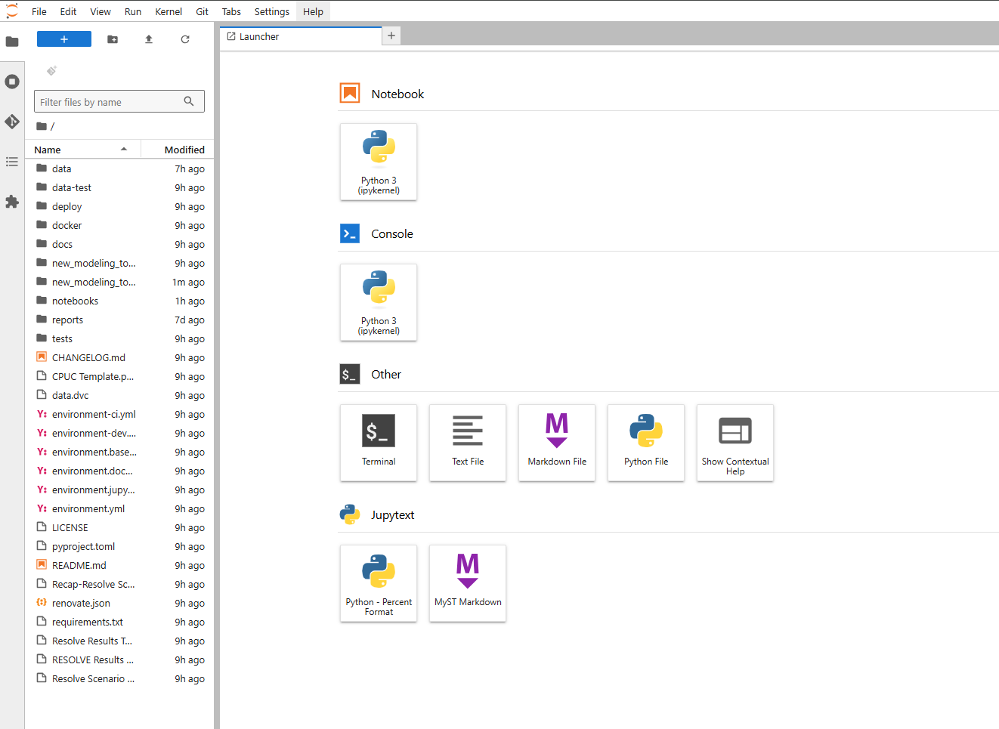
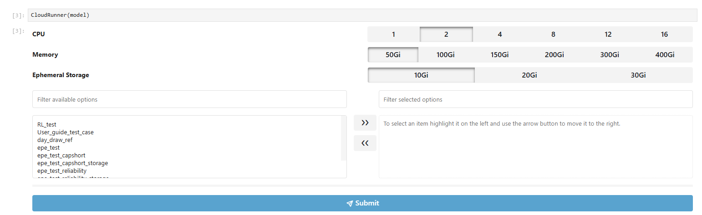
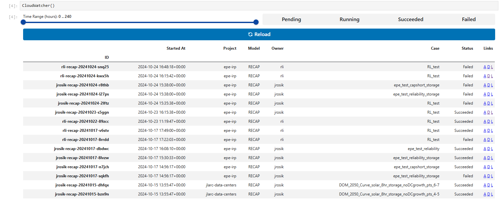

# 🤞 3. Running RECAP

```{article-info}
:date: Sept 15, 2023
:read-time: 20 min read
:class-container: sd-p-2 sd-outline-muted sd-rounded-1
```

## Set-up for Running RECAP
In order to run RECAP you will follow the general workflow. Note that both EC2 set-up and cluster set-up require coordination
with other E3-ers so please reach out and plan accordingly.



:::::{dropdown}  EC2 Set-up 

### EC2 Set-up (1-2 day lead time)
* Request EC2 Instance: **Reach out to Pete to request an EC2 instance.**
* [EC2 instance assignments are tracked here](https://app.asana.com/0/1207374357427622/1207374762698084).

:::::

:::::{dropdown} Pull recap repo into project folder + Set up kit envt

### Pull recap repo into project folder + Set up kit envt
* Follow kit set-up instructions [here](https://docs.ethree.com/projects/kit/en/latest/quick_start.html).
* Use the following branch for RECAP: `recap_main`
  * You can checkout this branch using your IDE (Pycharm, VSCode), Github Desktop, or the command `git checkout [BRANCH_NAME]`.

:::::

:::::{dropdown} Cluster Set-Up (1-3 day lead time)

### Cluster Set-Up (1-3 day lead time)
These Steps for Cluster Set-up assumes you already have a working case in an EC2 instance. This helps you get your project on the cluster.
* Get permissions for AWS, FrontEgg, and 

the next sections will point you to the right places for permissions

::::{dropdown} Cluster Set-Up (1-3 day lead time)

#### AWS
* If you do not have AWS credentials (if you do, there is an AWS tile on your Okta home page): Put in a ticket with [WilldanIT](https://helpdesk.willdan.com) 
to add a new user's Willdan Email Addresses to the AD group: "E3 Developer". Do not mention AWS in the request. 
* Once you have AWS permissions you will need to configure your `aws-cli`. These instructions are provided in the 
general cluster guide [here](https://docs.ethree.com/en/latest/analytics/cloud/resolve.html).

#### Front Egg
* Ask Pete Ngai (IT manager) for instructions

#### Datadog?
* Ask Pete Ngai (IT manager) for instructions

### Setting up project onto JupyterHub
By the end of this, you should have the following down:
1. Created a project-specific __Workspace__
2. Linked your Github Account to your Workspace through a __SSH Key__


#### 1. Create your Workspace (For those with Github Write access)

1. Go to the following link: `https://github.com/e3-/enkap-saas-controller`
2. Pull the `main` branch
3. Go to the folder within the branch `/clusters/x-ray/platforms/e3labs` 
4. Copy an existing project `.yaml` folder and create a new `.yaml` folder for your  
5. Open the `.yaml` and change the following fields:
   * `metadata/name:`
   * `e3/gurobi/license:`
   * `workflow/model:`
   * `workflow/projectId:`



6. Save the file
7. Commit the changes and push back to main


#### 2. Link Github Account through an SSH Key
1. Once you create a workspace, open a browser and enter this link: __https://jupyterhub.e3labs.x-ray.ethree.cloud/__
2. Start the server associated with your workspace / project
3. Once you start your server, this is the home page for JupyterHub 


4. Open Terminal from your server / workspace
5. Copy and paste the following codeblock and hit enter

```{code}
ssh-keygen -t ed25519
```
6. It will prompt you for a file in which to save the key, hit `enter` instead 
7. It will ask for a passphrase, hit `enter` instead 
8. It will prompt for the passphrase once more, hit `enter` again. 
   9. A total of 3 `enters` will get you to the following results. This is normal
10. This will create a window that will look similar to the screenshot below

11. Now copy and paste the following code block

```{code}
cat .ssh/id_ed25519.pub
```
11. This will generate a SSH key, see the screenshot below for an example. We will need this later in step 16.
12. Open a new tab in a browser and go to https://github.com/e3-
13. Sign in through the organization page
14. Once signed in, go to the top right and click the profile icon, then the tab called “Your organizations”


15. Once there, click “SSH and GPG Keys” on the tab on the left bar, and click “New SSH key”


16. This will prompt you to add the SSH key. Enter the information and add the key. This will prompt a 2FA authentication.
    * __Title__ = [WD username]@jupyter-[WD Username]
    * __Key Type__ = Authentication Key 
    *  __Key__ = [SSH key generated in Step 11]



17. Once you get to this page with a new SSH key window, click the dropdown for “Configure SSO” and click “Authorize” next to the e3- organization
18. Go through the steps to authorize until you return back to this page. This completes linking Github to your Workspace


::::

:::::

## Running RECAP Locally / EC2


> ### EC2 Background Info
> * AWS EC2 instances are remote desktops that enable E3 to (1) Size instances according to project needs and (2) Utilize a shared (Z:/) drive.
> * For a new project, you will have to request to be assigned an EC2 instance
> * **Reach out to Pete to request an EC2 instance.**
> * [EC2 instance assignments are tracked here](https://app.asana.com/0/1207374357427622/1207374762698084).
> * An EC2 instance is used to perform initial model set-up and to run preliminary cases to confirm
that the system is behaving as expected.


The instructions for running a case are spelled out in detail in the [Toy Model guide](toy_model.md).

These same instructions apply whether the case is run locally or on an EC2 instance.

Instructions specific to running the model are re-included below for context.

### Running RECAP from the UI
**Choose the case and execute the model:** Click the cell that contains the correct case and <u>press “Run Recap
   Cases” button</u> to run the selected case. This will initiate a separate Command Prompt window showing the progress
   of the model.

::::{dropdown} can I execute the model from the command line?What’s happening here?

   > <font color='#8AAC46'>***can I execute the model from the command line?***</font>
   >
   > Recap 3.0 can also be run from the command line! This can be useful if the UI macros are giving you trouble.
   >
   > To run Recap from a command line, open a Command Prompt (or another terminal app, like PowerShell) in
   the `“./kit/Recap/”` folder and activate the environment using the following
   command: `conda activate [environment-name]` (per the setup example above: `conda activate nve-Recap-kit`). Then use
   the following command to run the case: `python run_model.py`.
   >
   > To specify which case you’re running, update the `cases_to_run.csv` within the `“./data/settings/Recap/”` folder.
   Users now only have the choice to run one single case, the developer team is working on speeding modeling up to run a
   batch of cases in parallel.

::::

## Running RECAP in the Cluster

* The cluster provides the most scalable way to run RECAP (and RESOLVE).
* Users should first confirm the model behaves as expected on an EC2 instance before migrating runs onto the cluster.
* The following sections will guide you to (1) run cases on the cluster and (2) sync results to your folder
  * If you have not set up on the cluster, see the above instructions to set up the Cluster. It will take 1 day to fully set up.


__Running on the cluster only works if you have an active branch in `kit` with all your cases committed to that specific branch.__

### Running Cases

1. Open a browser tab and enter the following link: https://jupyterhub.e3labs.x-ray.ethree.cloud/hub/home 


2. Choose the Workspace for your project and click start. Please see set up instructions for Workspace setup if your project is not present.

3. If github is correctly linked, your project folder should already be loaded. If not, you must log into Github through JupyterHub and have an SSH key generated. See ("2. Link Github Account through an SSH Key")[2. Link Github Account through an SSH Key] above
4. To ensure that your project is synced, open Terminal (3rd row down, 1st icon on the left) and type the following

```{code}
dvc pull
```
5. Once down, return to the home page and navigate to the `notebooks` folder and open `cloudrunner.ipynb`
6. Once that's open, run all the code block by select the block and hitting `ctrl`+`enter`
7. You should see 2 main windows. 
   * __Cloudrunner__ >> A window with a Case List of all Cases you've generated
   *  __Cloudwatcher__ >> A window of Case Statuses.

8. Cloudrunner allows you to drag and select cases you want to run in parallel. Choose your cases and move it to the right window using the arrows. Submit cases by clicking the `Submit` button
   * It's important to configure the right CPU, Memory Size, and Ephermeral Storage. Ask Adrian, Ruoshui, Karl for more information about these.
10. Once you submit cases, hit the `Reload` button in Cloudwatcher.
10. Each case you've submitted should show up in Cloudwatcher. At this point, any project member can monitor the cases by running the Cloudwatcher block.
11. Using the Cloudwatcher, you're able to monitor cases that are running, done, or failed. Use the links `D` and `L` to monitor the case running memory size and logs, and use `A` if you are interested in the Argo workflow.
    * Note: it's good to know what the links do, but if you have guaranteed success in an EC2 instance, you rarely need to check these unless you're trying to gauge memory size.

### Syncing Results


