# 📊 4. Analyzing Results 

```{article-info}
:date: Sept 18, 2023
:read-time: 60 min read
:class-container: sd-p-2 sd-outline-muted sd-rounded-1
```

There are some common analyses performed both prior to & after Recap runs, and we have a dashboard tool to help you do
that!  
<br>

:::::{card} 📢 <font color='#55C0CF'>Recap Analytical Tool</font>
:class-title: sd-fs-5

The Recap Analytical Tool is an **interactive Jupyter Notebook** with built-in browser controls, where analysts can
visualize and manipulate charts / data to conduct basic input checking and results inspection.
<br>

::::{grid} 2
:gutter: 3
:class-container: sd-d-block

:::{grid-item-card}

The <font color='#034E6E'>**Case Result Viewer**</font> section is designed to compare results across multiple cases.
This includes case tuned / untuned reliability results, capacity short, portfolio ELCC, TRN, etc.

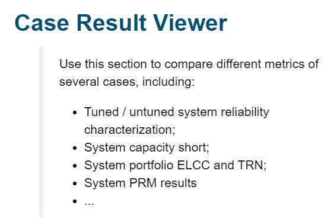

:::
:::{grid-item-card}

The <font color='#034E6E'>**Individual Case Deep-Dive**</font> section is designed to zoom into one case, look at
day-to-day, hour-to-hour dispatch results and understand system dynamics.

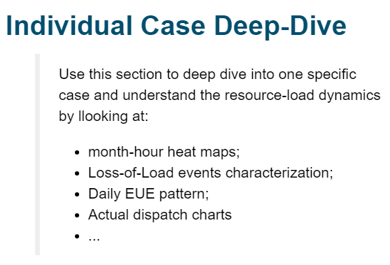

:::
::::

+++

- The dashboard `“Recap Analytical Tool.ipynb”` can be found under the `"kit/notebooks/"` directory.
- Starting from scratch? First complete the <font color='#034E6E'>Environment Setup</font> section of
  the [](0_getting_started.md) page.
  :::::

<br>

## Case Result Viewer

As stated before, this section allows you to assess reliability metrics across multiple cases simultaneously.

Traditional Recap outputs include:

- System Reliability Metrics
- System Total Resource Need (TRN) and Capacity Short
- Achieved / Target Planning Reserve Margin (PRM) <font color='grey'>*(Under Development!)*</font>
- ...

For detailed explanation of different types of metrics Recap report, refer to the section following.

:::{dropdown} Dashboard Example
:class-title: sd-fs-6

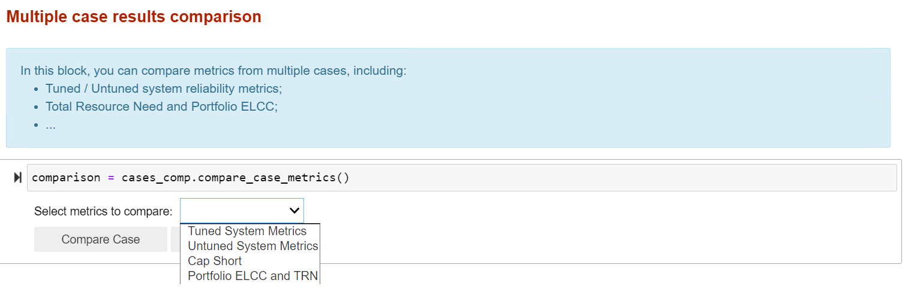

:::

<br>

## Individual Case Deep-Dive

This section is primarily used for reading reliability metrics results and conducting detailed analysis on one specific
case of interest. Each deep dive analysis can answer a specific question about the evaluated system and help modeler
better understand the system characteristics.

> 💬 This page will illustrate part of analysis contained in the dashboard, but it is <u>NOT</u> a step-by-step guide.
> You may find more practical instructions within the dashboard itself.

<br>

### Deep Dive # 1. View System Reliability Metrics

In this subsection, you can check out the 5 loss of load metrics Recap reports to examine the system reliability
situation. There are both tuned vs. untuned system reliability metrics depending on the type of case running.

You can also view perfect capacity shortfall, TRN, and portfolio ELCC results for the system when possible.

> 💬 Note that not all cases will have all the results printed out. To ensure you’re getting the right metrics, refer to
> the user guide or the table below to understand which settings create what outputs
> 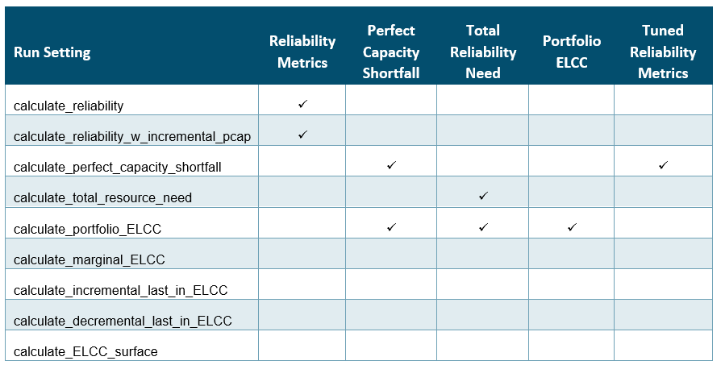
<br/>


:::{dropdown} Dashboard Example
:class-title: sd-fs-6

In this example, we showed the result of a `calculate reliability` case.

This means you only get the reliability of the base system, without the capacity shortfall, the total resource need, the
portfolio ELCC, not the equivalent tuned system metrics as well.

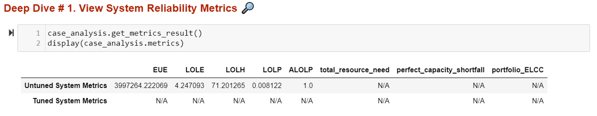

:::

:::{dropdown} ❓ What do these metrics measure tell about the system?
:class-title: sd-fs-6

{octicon}`comment;2em;sd-text-info` **Definitions of Reliability Metrics**

Typically, LOLP models report system reliability in annual terms. They attempt to measure the average annual <u>*
*frequency, magnitude, and duration**</u> of loss of load events across the loss of load probability modeling
simulation.

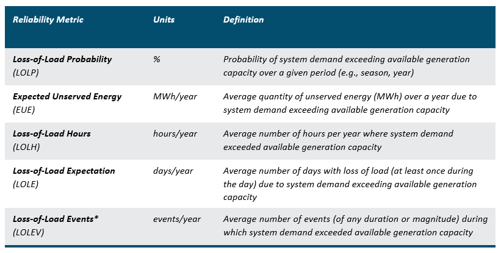
<br>

{octicon}`comment;2em;sd-text-info` **Definition of other Recap results**

Other metrics reported by Recap provide more information about how far/close the evaluated system is from an at-criteria
system from a perfect capacity perspective.

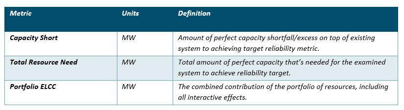

:::

<br>

### Deep Dive # 2. View ELCC Results

You can use this subsection to check ELCC results of a case. This includes marginal ELCC, incremental last-in ELCC,
decremental last-in ELCC, and ELCC surface results.

A more comprehensive view of ELCC case setting, name and size of incremental resources, etc. can be found in
the `ELCC_results.csv` file in the result folder, but you can use the analytical tool as an easy portal to check out
capacity shortfall or surplus of different systems.

:::{dropdown} Dashboard Example
:class-title: sd-fs-6

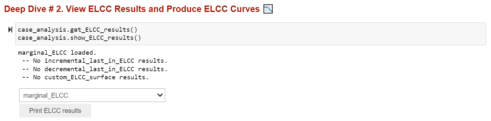

:::

:::::{dropdown} ❓ What’s the difference between Marginal, Incremental, Decremental, and ELCC Surface?
:class-title: sd-fs-6

These run settings depend on the use case, but the concept across all these are the same: **calculating the capacity
value of resources relative to a base portfolio**.

::::{grid} 1 1 1 1
:gutter: 1

:::{grid-item-card} **Marginal ELCCs**

**Marginal ELCCs**: Base Portfolio + multiple new resource at the same MW increment.

<u>Use Cases</u>: Bid Evaluation, Capacity Accreditation for Markets, ELCC forecasting

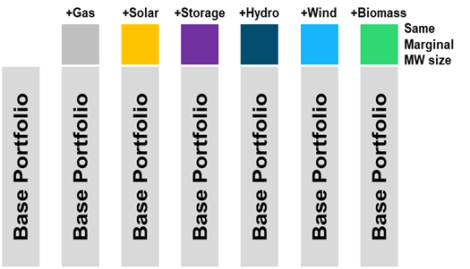
:::

:::{grid-item-card} Incremental or Decremental ELCCs

**Incremental or Decremental ELCCs**: Base Portfolio + / - multiple existing resources in portfolio.

<u>Use Cases</u>: Bid Evaluation, Capacity Accreditation for existing and planned portfolio

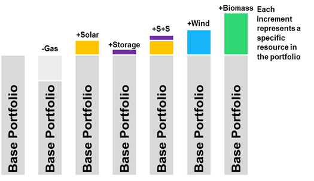
:::

:::{grid-item-card} ELCC Surface

**ELCC Surface**: Base Portfolio + 1 or 2 new resources at the multiple MW increments.

<u>Use Cases</u>: Inputs to Capacity Expansion

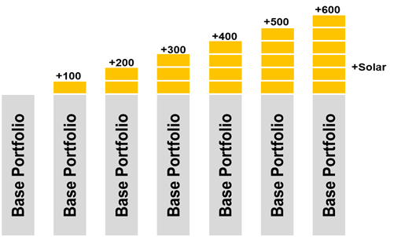

:::

::::

:::::

<br>

### Deep Dive # 3. Month-Hour Loss-of-Load Heat Map

A month-hour heat map can be created in this subsection. To load the correct data, you need to first choose whether to
show the map for “as-it-is” (i.e., untuned) system or “at-criteria” (i.e., tuned to selected metric) system. You also
have the option to create a map with different types of metrics.

:::{dropdown} Dashboard Example
:class-title: sd-fs-6

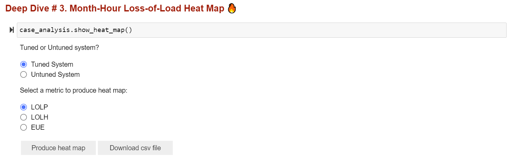

The illustrative figure below shows a system where there are significant resource needs around early morning and later
evenings of winter months. The level of redness in the map reflects the level of loss of load probability or magnitude.

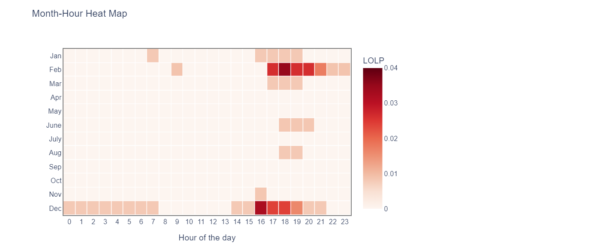

:::

:::{dropdown} ❓ What does month-hour heat map tell you? How to read it?
:class-title: sd-fs-6

The month-hour heat map takes reliability metrics and gives a more granular look at where the loss of load risk is.

Specifically, it shows the **likelihood of loss of load in an average month and hour** to illustrate **when** the
reliability challenges are throughout the year. E.g., in a solar-heavy, summer peaking system, month-hour heatmaps may
show a <u>large LOLP need on hot, late summer afternoons/evenings</u> as the sun is setting, while in a deeply
decarbonized electricity system, the most pronounced resources needs could be extended to longer durations <u>during
sustained periods of low renewable generation.</u>

:::

<br>

### Deep Dive # 4. Outage Events Analysis

To better understand the nature of system loss-of-load events (i.e., its duration, frequency, and magnitude, etc.), you
can use this subsection to generate two charts

1. A **scatter plot** of **loss-of-load event duration vs. the average unserved energy magnitude**; and
2. A **histogram** showing the **distribution** of loss-of-load event duration in the system.

By hovering around the scatter point in the first chart, you can also see the exact date (and thus season) when an
ultra-long loss-of-load event happens.

:::{dropdown} Dashboard Example
:class-title: sd-fs-6

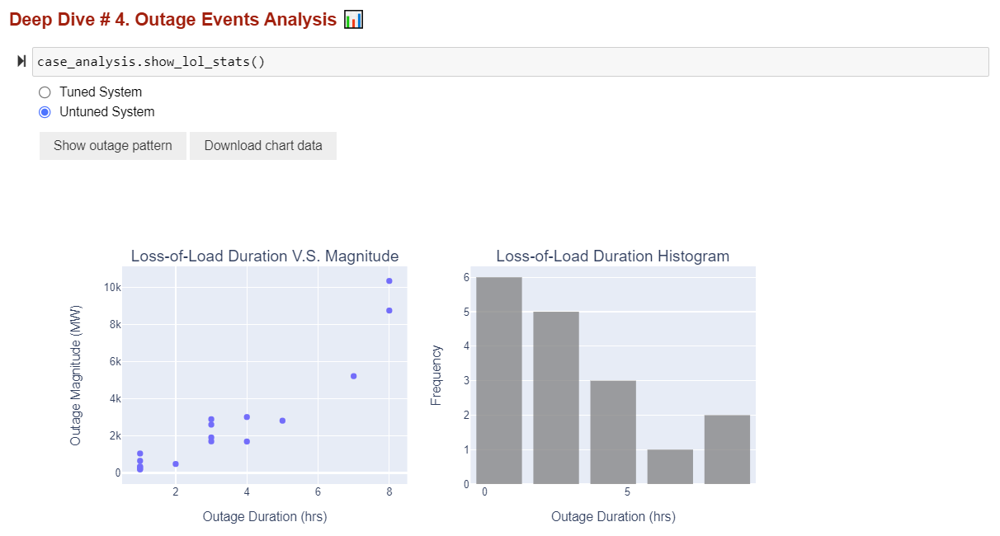

:::

:::{dropdown} ❓ What’s the takeaway of the outage event analysis?
:class-title: sd-fs-6

By looking at the scatter plot and the histogram chart, here are some questions you should ask:

- What do the majority of the loss-of-load events look like? Are they large events with long duration or short events
  with small unserved energy magnitude? **What does that imply about the net load shape of the system?**
- When does the longest events happen? **What does the timing and length of these long-duration loss-of-load events tell
  you about the system?**
- Is the distribution of loss-of-load event duration expected? What’s the average size of these events? **What the
  implication on storage capacity value in this system?**
- What can you look at to confirm your hypothesis? **Maybe some dispatch plots?**

:::

<br>

### Deep Dive # 5. LOL Day Daily EUE Pattern

In this subsection, you can further zoom into the loss-of-load days and look at what the daily unserved energy shape
looks like.

:::{dropdown} Dashboard Example
:class-title: sd-fs-6

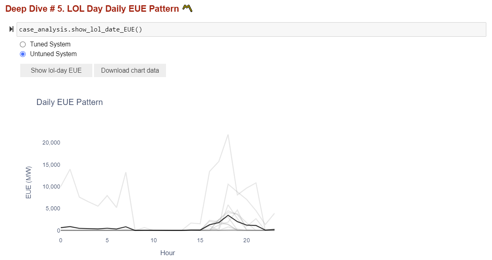

:::

:::{dropdown} ❓ What story does the daily EUE chart tell?
:class-title: sd-fs-6

Different from month-hour heat map, which shows the average loss-of-load probability in each hour of the day in all
months, the daily EUE chart draws **all loss-of-load events on a daily basis** in one chart, allowing the modeler to *
*see the range and frequency of unserved energy magnitude for one given hour.** This could be helpful in identifying
outlier dates or weather years in the system where there’re persistent loss-of-load events across all MC draw
simulation.

:::

<br>

### Deep Dive # 6. Dispatch Plot

The dispatch plot is probably the one and most important visuals for modeler to examine resource dispatch
characteristics in the system. In this subsection, you can draw a dispatch plot for either a tuned or untuned system,
between customized dates.

You will also have the option to show dispatch plots in two different ways:

1. **Economic dispatch** - assumes the “merit-order dispatch” which lets cheap renewable generation get dispatched first
   and fill in the rest of resource needs with thermal, imports, and other firm generation; and
2. **Recap dispatch** - follows the “heuristic dispatch” logic embedded in Recap, and stack resource availability /
   generation based on a fixed order from firm, renewable, to energy limited resources.

<u>The three steps of producing a dispatch plot are following:</u>

::::{tab-set}

:::{tab-item} Step 1️⃣ Follow the inline guidance and upload a csv file to categorize resources in the system into
different dispatch groups, for visualization purpose.

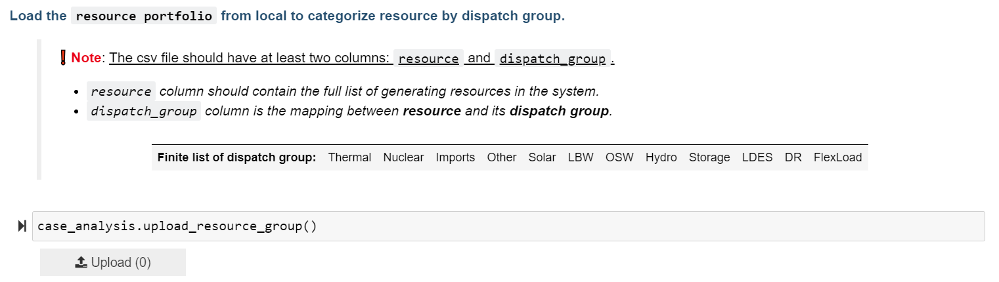
:::

:::{tab-item} Step 2️⃣ Decide which dates to look at, either by looking at the loss-of-load date list, or refer back to
Deep Dive #4 or #5 for dates that’s of interest.

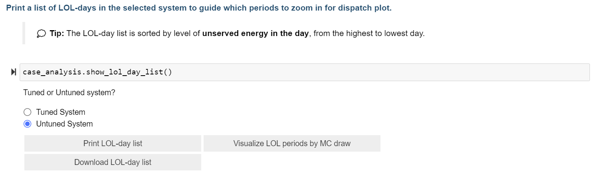

:::

:::{tab-item} Step 3️⃣ Select the correct system and MC draw, enter the date information, and then make the dispatch
plot as you like.

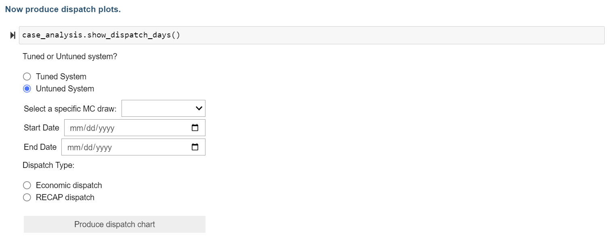
:::

::::

:::::{dropdown} Dashboard Example
:class-title: sd-fs-6

::::{grid} 1 1 1 1
:gutter: 1

:::{grid-item-card} Economic Dispatch example
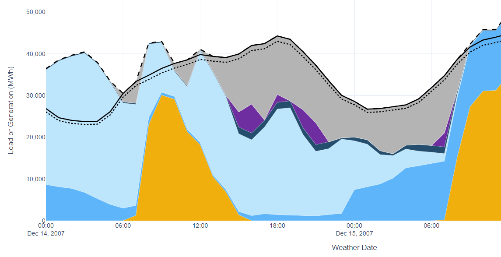
:::

:::{grid-item-card} Economic Dispatch example
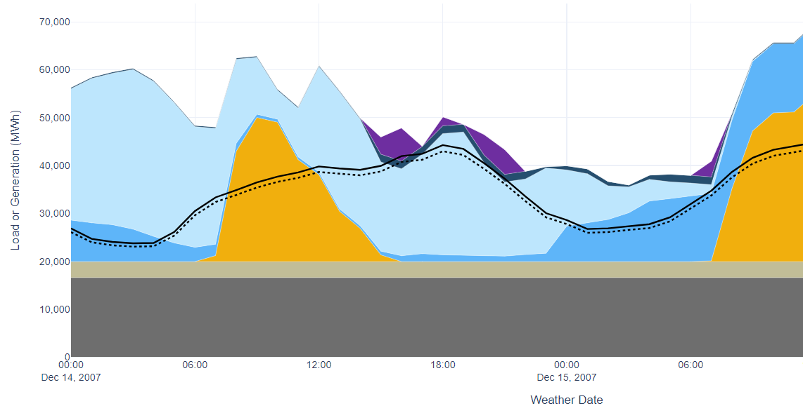
:::

::::
:::::

:::{dropdown} ❓ What to look for in a dispatch plot?
:class-title: sd-fs-6

Dispatch chart is the most direct way to look at how system resources are dispatched to meet load + operating reserve
requirements. The goal is to help **solidify your hypothesis on what causes outages in the system and build a narrative
around your results.** Something interesting to look for in a dispatch plot include:

- What caused the loss-of-load event? Is it high evening load from electrification, or is it consecutive low renewable
  generation? Or a large generator outage?
- What does the renewable generation pattern look like in normal days vs. extreme days and how do solar and wind shape
  the net load peak differently?
- How do energy-limited resources (e.g., storage) charge and discharge in the system? Are they soaking up excess
  renewable generation? How well do they complement with the renewable generation, especially during extended renewable
  drought periods?
- In the case of “Recap dispatch” charts, how does firm resource outages impact resource-load dynamics?

:::

<br>

### {bdg-info-line}`Optional` Deep Dive # 7. Uncertainty Analysis

This is an optional section for modelers to assess the uncertainty of one annual metric reported in Recap. You can see
how EUE or LOLE varies across weather year and across MC draw, in the tuned or untuned system. Advanced users can take
the metric table and explore the standard deviation, stand error, or relative error, etc. of metrics in each dimension
to better understand the uncertainties embedded in the average annual metric Recap reports.

Modelers also have the option to visualize how metrics vary across MC draw in each weather year by clicking “Visualize
Weather Year metrics”. This will generate two charts showing the gross load peak of each weather year as well as the
range of EUE / LOLE across different MC draws for the specific year. The color of gross load bars indicates the timing
of peaks (blue represents winter while orange represents summer).

:::{dropdown} Dashboard Example
:class-title: sd-fs-6

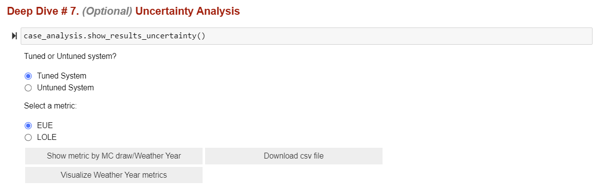

_Example result when you click "Visualize Weather Year metrics":_

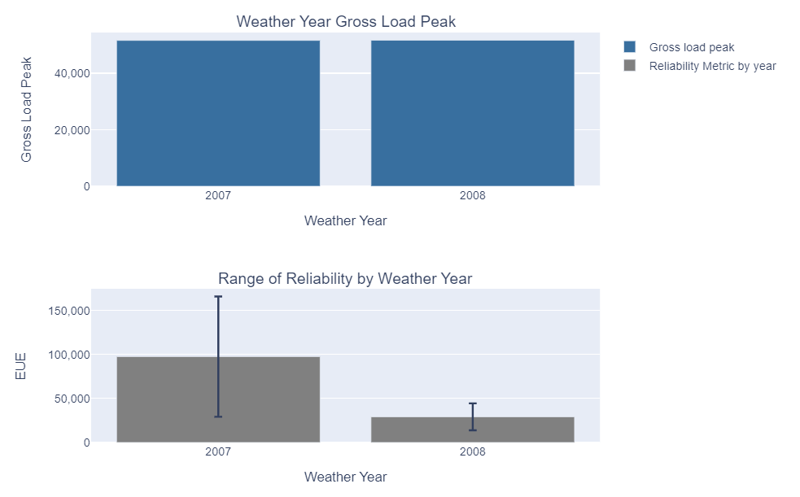

:::

:::{dropdown} ❓ Why do we care about metrics uncertainty?
:class-title: sd-fs-6

In the simulation of extended weather years for multiple times, Recap will naturally incorporate two layers of
uncertainties:

1. **Weather year uncertainties**: each weather year modeled (e.g., 1979-2020) has a varied load shape and level of
   peakiness, thus different LOLP needs;
2. **Modeling uncertainties**: different MC draws will introduce a variety of thermal outage schedules, renewable
   generation pattern, etc., which leads to slightly different resource performance and may interact with loads to
   create unique LOLP needs.

By looking at the average, standard deviation and standard error of metrics across MC draw or across weather years, and
sometimes across both dimensions, modeler can establish more confidence in our characterization of the system dynamics.

:::

:::
