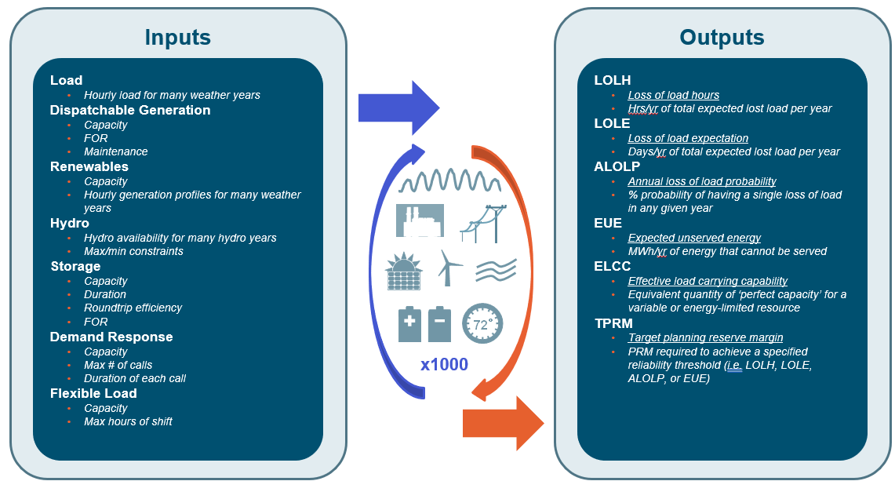

# 🔌 Recap

```{toctree}
:hidden:

0_getting_started.md
1_inputting_data.md
2_inputs_checking.md
3_running_model.md
4_analysis.md
nitty_gritty.md
faqs.md
toy_model.md
```

```{note}
Something wrong or missing? Contact Karl + Ruoshui!
```

## What is Recap?

<font color='#034E6E'>**Recap 3.0**</font> is a time-sequential, Monte Carlo simulation model that evaluates the hourly
availability of resources over hundreds (or thousands) of simulated years to estimate the resource adequacy (RA) of an
electric system.

It is primarily used to produce some, or all, of the following.

- Calculating system reliability
- Calculating a total reliability need (TRN) based on a reliability target
- Determining a planning reserve margin (PRM)
- Calculating resource effective load carrying capability (ELCC)

### Inputs and Outputs of Recap



## Starting a New Project?

0. **LOG YOUR PROJECT** in the
   📜 [project log here](https://ethreesf.sharepoint.com/:x:/s/Models/EUg2vKz8Gc1DvCJftF7Yk00BMhBkLv_C9EXvMHg1tSrq2w?e=Kmj0xr)!
   **This is a necessary step to track projects, issues, etc.**
1. **GET TRAINED** Refer to our 2-week training slide
   decks ([Week 1](https://ethreesf.sharepoint.com/:p:/s/Models/EVlnwOpfLk1PhJkYSMWZKWUBxn5hqld2GuWn2G9W1iFU5w?e=j9CeYV) + [Week 2](https://ethreesf.sharepoint.com/sites/Models/Shared%20Documents/Recap%203.0%20Dev/Documentation/Training%20+%20Homework/Recap%20Training%20-%20Week%202%20Recap%20Concepts%20and%20UI%20Walkthrough.pptx?web=1))
3. **GET SET UP** Follow the set-up instructions in the 🏃‍♀ [Quick Start Guide](../quick_start.md). Do NOT start by
   copying an old project (code / UI may have been updated).
3. **GET YOUR INPUTS** Coordinate with your PM and TL to ensure you have the right set of inputs for your system.
4. **QC + ANALYSIS** QC your inputs and analyze your results with help from the templates and Jupyter notebook in
   📊 [Recap Analysis](4_analysis.md).
5. **STAY ACTIVE + ASK QUESTIONS** Has your question/error been resolved before? Check the
   ⚠️[FAQs and common errors workbook](https://ethreesf.sharepoint.com/:x:/r/sites/Models/_layouts/15/Doc.aspx?sourcedoc=%7BFA43744B-E0D1-435E-81A9-779BCE852A9A%7D&file=Recap%203.0%20FAQs%20-%20LIVE.xlsx&action=default&mobileredirect=true).
   If not, ask your questions in Teams and, once resolved, add it to the workbook!

### 🤔 Recap + RA Links

- [Teams Channel - Recap](https://teams.microsoft.com/l/channel/19%3af74a25d526de44718258b0b412530c6f%40thread.skype/Recap?groupId=90cb82ef-4a8a-4379-a1e1-2b6712bfe2d6&tenantId=4ecc8387-acae-4b64-8641-e32056145263)
- [Recap Training Materials](https://ethreesf.sharepoint.com/:f:/s/Training/ErxbkOJ7oSdKjPFZm3e4STUBzoa1XNnGH9KNeCTuvLdYyQ?e=aowzBO)
- [RA Reports and References](https://ethreesf.sharepoint.com/:f:/s/Models/Eo2_mvmDsMlBuIz1eo3FNc4BccfOq5XPAU01fvNWkYhbrg?e=i7ujxo)
- [Primer on Resource Adequacy](https://ethreesf.sharepoint.com/:p:/s/Training/EYbBqLe1C9tDoidZNay0MXUBqVaBI7Qecom_QcI4Ptb48Q?e=aBu1zg)
- Understanding ELCCs
    - [ elccs (*do hw
      1*)](https://ethreesf.sharepoint.com/sites/Models/Shared%20Documents/Recap%203.0%20Dev/Documentation/Training%20+%20Homework/Recap%20Training%20Homework%201%20-%20Calculating%20ELCC.xlsx?web=1)
    - [ELCC Training Slides](https://ethreesf.sharepoint.com/:f:/s/Models/EhM06uuZrIZIh7gKf10sNh4BNOg1NU81kihM5DyWbdA7Jw?e=9xJfBX)

