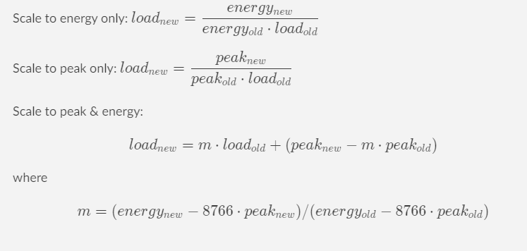
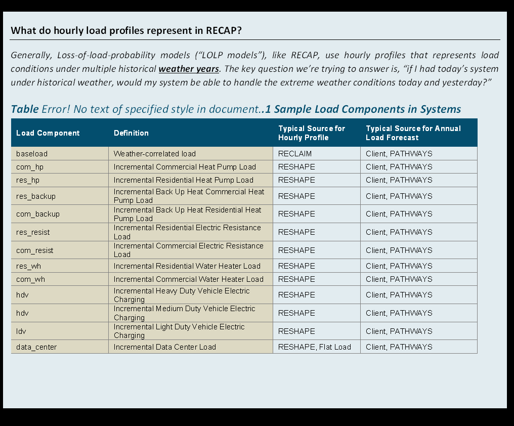
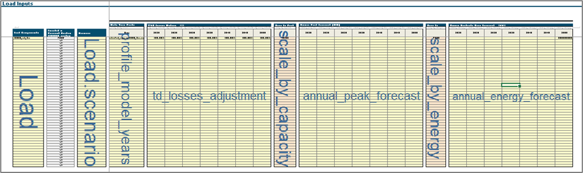

# Load Components

There are two types of load data needed: (1) hourly load profiles and (2) annual load forecast. The hourly load profiles
are scaled by the annual load forecast to the modeling year of interest. The model will scale up the NN load profile
using linear scaling algorithms:

    Scale to energy only:   $load_{new}=  \dfrac{energy_{new}}{energy_{old}}⋅load_{old}$
    
    Scale to peak only:     $load_{new}=  \dfrac{peak_{new}}{peak_{old}⋅load_{old}}$
    
    Scale to peak & energy*:   $$load_{new}=  m \cdot load_{old} + (peak_{new} - m \cdot peak_{old} )$$   where $$ m = (energy_{new} -8766 \cdot peak_{new})/(energy_{old} -8766 \cdot peak_{old}) $$


Multiple load components can be added together in Recap to build up different future loads (e.g., “BAU” vs.
“Electrification”).



##### Load Tab Layout in UI



```{eval-rst}
.. autopydantic_model:: new_modeling_toolkit.system.electric.load_component.Load
```