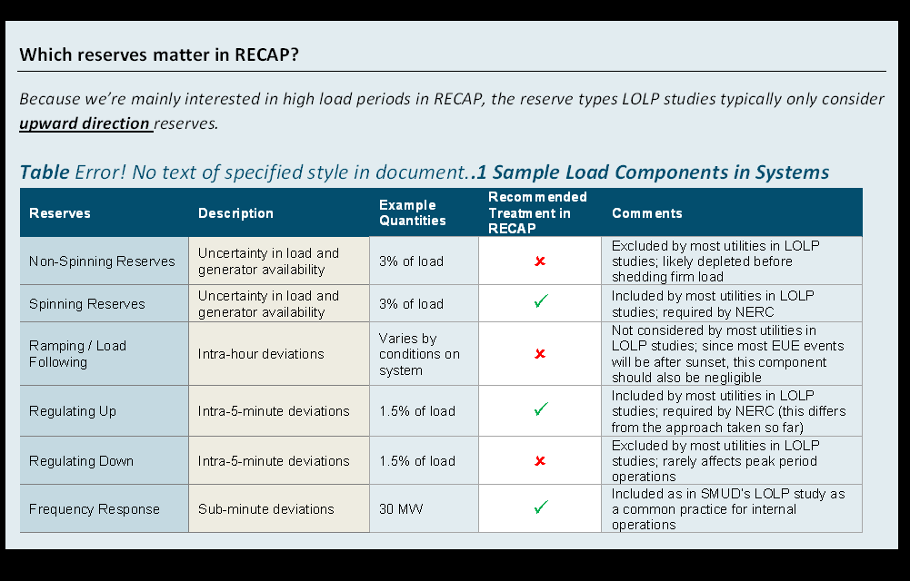
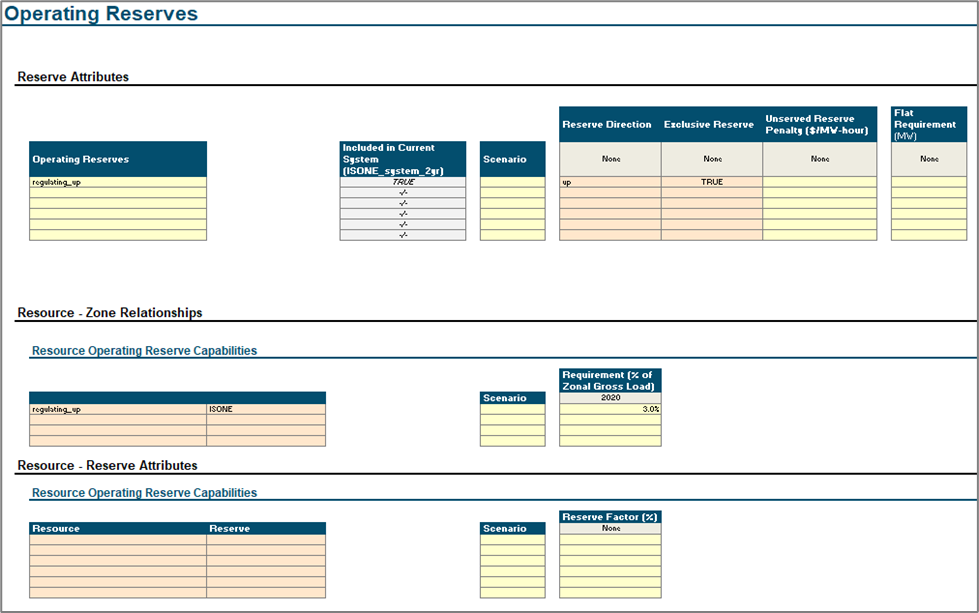

# Operating Reserves

In Recap, Reserves are represented in two ways  (1)  as a total MW amount held across every hour (e.g. +300MW per hour)
or (2) a percentage of hourly load or (3% above hourly load).



##### Operating `Reserves` Tab Layout in UI



```{eval-rst}
.. autopydantic_model:: new_modeling_toolkit.system.electric.reserve.Reserve
```