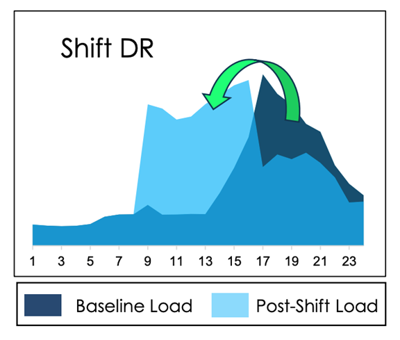
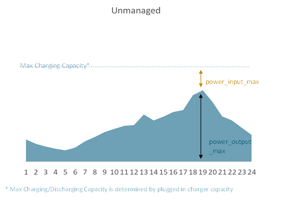
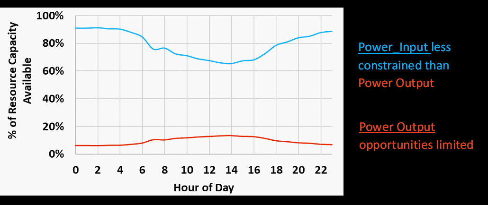
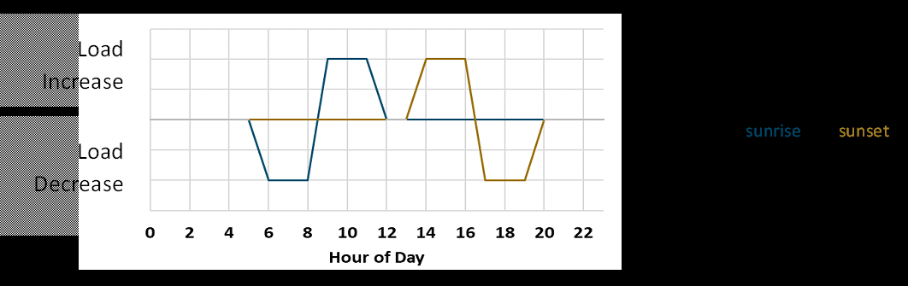

# Flexible Loads

:::::{dropdown} Data Fields & Method Definitions
:icon: codescan

::::{dropdown} New
```{eval-rst}
.. autopydantic_model:: new_modeling_toolkit.system.electric.resources.flex_load.FlexLoadResource
   :no-index:
   :inherited-members: new_modeling_toolkit.system.electric.resources.unit_commitment.UnitCommitmentResource, new_modeling_toolkit.system.electric.resources.storage.StorageResource
```
::::

::::{dropdown} Inherited
```{eval-rst}
.. autopydantic_model:: new_modeling_toolkit.system.electric.resources.generic.GenericResource
   :no-index:
   :inherited-members: new_modeling_toolkit.system.asset.Asset
```
::::

:::::

Flexible loads formulation is based on [^flexloadformulation]

[^flexloadformulation]: O'Connell, et al., "On the Inclusion of Energy-Shifting Demand Response in Production Cost
Models: Methodology and a Case Study," National Renewable Energy Laboratory (NREL), Technical Report, July 2015,
[https://www.nrel.gov/docs/fy15osti/64465.pdf](https://www.nrel.gov/docs/fy15osti/64465.pdf).
(PDF also
available [on SharePoint](https://ethreesf.sharepoint.com/:b:/s/Models/EZMdgFPPaolNv_7pM3AJGcgBCqJcOM1-fDo08oMtEao14g?e=LtFMLI))

The FlexLoadResource class represent resources that perform demand response by shifting its load profile to reduce
consumption during high demand periods without sacrificing end-user interests. Flexible Load Resources are also commonly
referred to as “Shift DR”. Examples of flexible load resources include water heaters, electric vehicle chargers, and
smart thermostats.

FlexLoadResource inherit all attributes and constraints from ShedDrResource and StorageResource. The following are
required inputs are not unique to FlexLoadResource but should be considered carefully.

##### Hourly shift up and down limits:

The hourly flexibility of a resource depends on the baseline load shape assumed. Baseline load shapes determine the
amount of head room that a resource can charge or discharge in each hour, as illustrated in the figure below. The
baseline load shape of a flexible load resource is included in the system load profile, so any power input or power
output is a deviation from the assumed default shape. This concept is unique to flex loads.



The hourly shift limits are input into Recap as power_output_max and power_input_max timeseries profiles.
Power_input_max represents maximum “headroom” on loads, for example the number of “plugged in” devices minus the (
unshifted) baseline load of those devices. Power_output_max limits represent the portion of the (unshifted) baseline
load that could be reduced in an hour while still maintaining an acceptable amount of “service” (cooling buildings,
pumping water, etc).



##### Energy mileage:

For many loads there is significant potential to shift loads up and down for each hour. However, it is not acceptable
for the end-user for the load to be shifted more than its underlying consumption or an energy budget. Limits on the MWh
of shiftable load per day are enforced in Kit using the input ‘energy_budget_daily’. There are also optional
‘energy_budget_monthly’ and ‘energy_budget_annual’ options, but only ‘energy_budget_daily’ is required for all
FlexLoadResource. Please note: the energy budget is only for the power_output of the resource, shifting will enforce an
equivalent amount of power_input and therefore the actual mileage allowed will be double the input.



### Where do the data inputs go?

1. Resource Attributes will be specified **in the UI**
2. Custom attributes below can be specified as a timeseries, placed in `data > profiles`
    - Pmin Rating
    - Pmax Rating
    - Max Charging Rating (CSV file)
    - Daily Energy Budget
    - Annual Energy Budget 

