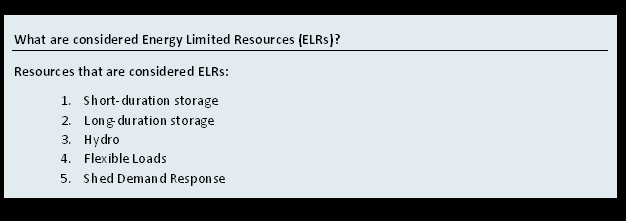
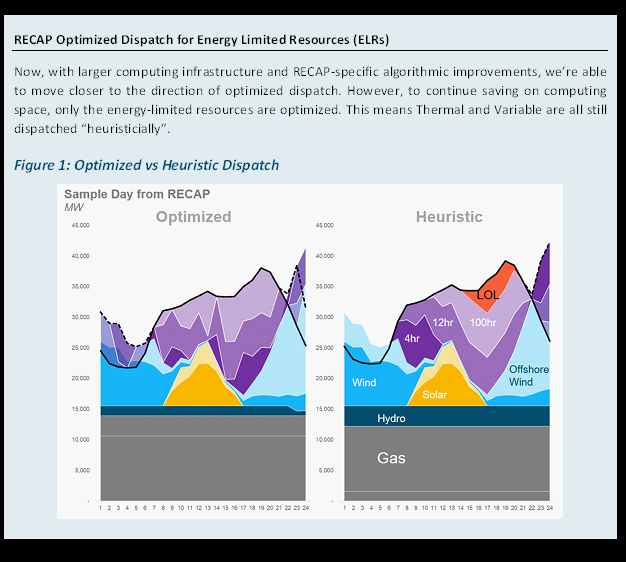

# Hydro

`Hydro` resources add energy budgets to resource dispatch: these energy budgets can be defined on a daily, monthly, or
annual basis. Unlike storage resources, which "charge" from the grid, hydro resources are intended to be used with
user-defined energy budgets.

### Where do the data inputs go?

1. Resource Attributes will be specified **in the UI**
2. Custom attributes below can be specified as a timeseries, placed in `data > profiles`
    - Pmin Rating
    - Pmax Rating
    - Max Charging Rating (CSV file)
    - Daily Energy Budget
    - Annual Energy Budget

### What are ELRs?

In Recap, HydroResources are considered energy-limited resources, a special class of resources in Recap that has two
types of dispatch: Heuristic or Optimized dispatch.

### what is heuristic dispatch?

### what is optmized dispatch?

