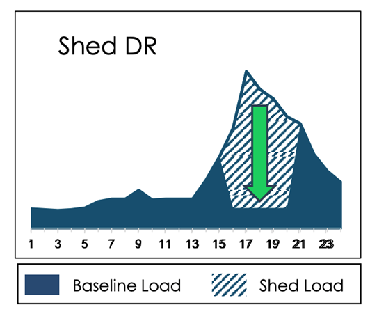

# Shed Demand Response


:::::{dropdown} Data Fields & Method Definitions
:icon: codescan

::::{dropdown} New
```{eval-rst}
.. autopydantic_model:: new_modeling_toolkit.system.electric.resources.shed_dr.ShedDrResource
   :no-index:
   :inherited-members: new_modeling_toolkit.system.electric.resources.unit_commitment.UnitCommitmentResource, new_modeling_toolkit.system.electric.resources.storage.StorageResource
```
::::

::::{dropdown} Inherited
```{eval-rst}
.. autopydantic_model:: new_modeling_toolkit.system.electric.resources.generic.GenericResource
   :no-index:
   :inherited-members: new_modeling_toolkit.system.asset.Asset
```
::::

:::::

ShedDrResource represent Shed Demand Response (or “conventional”) loads that can be curtailed to provide capacity
reductions.



Demand response programs are typically structured with certain limits and conditions to ensure grid reliability,
customer comfort, and fairness. These limits can vary depending on the specific program and region, but here are some
common constraints:

**_Duration_**: DR events are usually time-limited to avoid undue inconvenience for participants. They may range from
minutes to a few hours, but rarely extend beyond that.

**_Frequency_**: The frequency of DR events is limited to prevent excessive disruption. Programs often specify the
maximum number of events allowed within a certain time frame. In Recap, we allow the users to specify maximum daily
calls, monthly calls, and annual calls.

**_Seasonal Limits_**: DR programs may have different limits during different seasons, as electricity demand patterns
can vary significantly. Seasonal limits should be modeled in Recap by setting power_output_max to zero in the months
where DR calls should not occur.

Note: The code will set the unit_size to the size of the planned_capacity so that the number of available units is
always 1 for ShedDrResource and FlexLoadResource (because it inherits from ShedDrResource).

### Where do the data inputs go?

1. Resource Attributes will be specified **in the UI**
2. Custom attributes below can be specified as a timeseries, placed in `kit > data > profiles`
    - Pmin Rating
    - Pmax Rating
    - Max Charging Rating (CSV file)
    - Daily Energy Budget
    - Annual Energy Budget 

