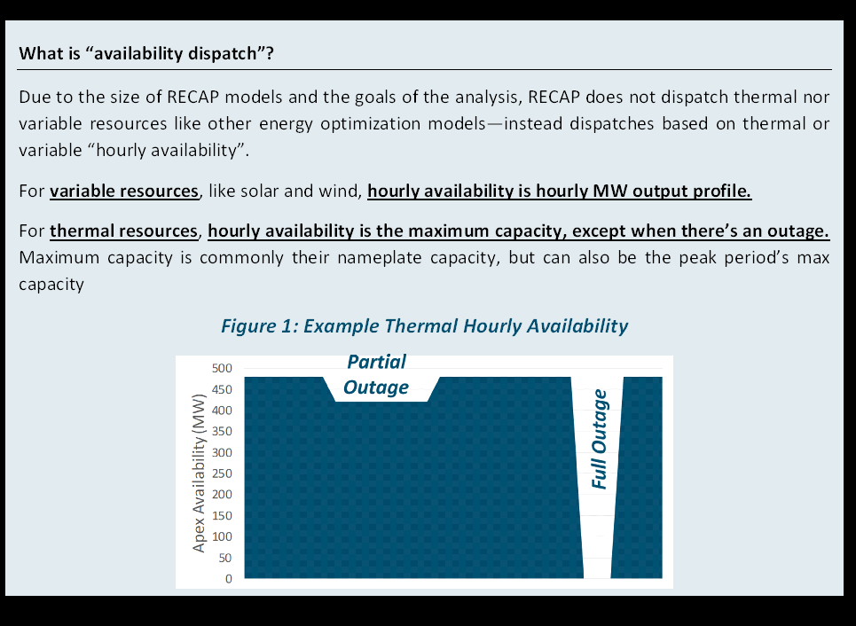

# Thermal

## Basic Thermal Resources

```{warning}
Docs are still missing variables, since those are defined on `formulation_block` and not class-level attributes.
```


### Data Fields & Formulation
```{eval-rst}
.. autopydantic_model:: new_modeling_toolkit.system.electric.resources.thermal.ThermalResource
   :private-members: _resource_fuel_consumption_constraint
   :no-inherited-members:
   :show-inheritance:
```
::::{dropdown} Inherited Data Fields & Formulation
```{eval-rst}
.. autopydantic_model:: new_modeling_toolkit.system.electric.resources.generic.GenericResource
   :no-index:
   :show-inheritance:
   :inherited-members: new_modeling_toolkit.system.asset.Asset
```
::::

### Reliability Dispatch in `Recap`

The ThermalResources class is for **_resources that can be dispatched without energy limits_**
(e.g. firm resources, dispatchable resources, etc.). We model the availability of dispatchable generation based on “net
dependable capacity” or “hourly available capacity”. Hourly available capacity is modeled by simulating maintenance &
forced outages from the OutageDistribution component. Using the forced outage rate of each generator, random outages are
introduced to create a stochastic set of available generators.



## Thermal Unit Commitment

### Data Fields & Formulation
```{eval-rst}
.. autopydantic_model:: new_modeling_toolkit.system.electric.resources.thermal.ThermalUnitCommitmentResource
   :private-members: _resource_fuel_consumption_constraint
   :inherited-members: new_modeling_toolkit.system.electric.resources.unit_commitment.UnitCommitmentResource, new_modeling_toolkit.system.electric.resources.thermal.ThermalResource
```
::::{dropdown} Inherited Data Fields & Formulation
```{eval-rst}
.. autopydantic_model:: new_modeling_toolkit.system.electric.resources.generic.GenericResource
   :no-index:
   :inherited-members: new_modeling_toolkit.system.asset.Asset
```
::::

As of [#465](https://github.com/e3-/kit/pull/465), the Resolve formulation now includes a basic, linearized unit
commitment formulation based on [^palmintier].

[^palmintier]: B. S. Palmintier and M. D. Webster, "Heterogeneous Unit Clustering for Efficient Operational Flexibility
Modeling," in IEEE Transactions on Power Systems, vol. 29, no. 3, pp. 1089-1098, May 2014,
[https://www.doi.org/10.1109/tpwrs.2013.2293127](https://www.doi.org/10.1109/tpwrs.2013.2293127).
(PDF also
available [on SharePoint](https://ethreesf.sharepoint.com/:b:/s/CECLong-DurationStorageStudy/ETcIUCv_Oz9DkpHy1ccWd1EB3HSgZkHVChswqDWNHv2zGA?e=pi0lX0)).

While unit commitment constraints are primarily designed for thermal unit commitment dispatch, we are reusing the unit
start/stop & minimum up-/down-time constraints for [](#shed_dr) and [](#flex_loads).

While this formulation differs from the formulation in previous versions of Resolve, it is significantly more compact
and widely used in literature. As with the previous Resolve formulation, unit commitment constraints "wrap around" each
representative period (in contrast to storage state-of-charge constraints that leverage the chronological periods to
span across representative periods).

```{note}
While unit commitment constraints are primarily designed for thermal unit commitment dispatch, we are reusing the 
unit start/stop & minimum up-/down-time constraints for [](#shed_dr) and [](#flex_loads).  
```


