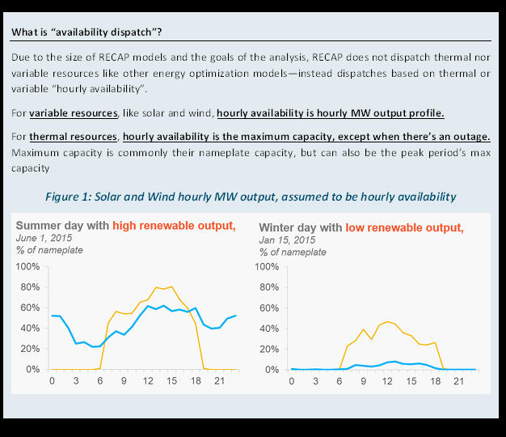

# Variable

`Variable` resources behave similarly to `Generic` resources, though

### What are VariableResources?

The VariableResources class represent resources that need a profile to represent their energy output. Resources like
Solar and Wind are classic examples of VariableResources, but it's any resource that may have a fixed profile.

### Where do the data inputs go?

1. Resource Attributes will be specified in the UI
2. Timeseries data (e.g. Solar Profiles) go into the `data > profiles` folder in Kit

### Recap dispatch treatment

In Recap, these resources are dispatched based on its availability, similarly to `Generic` resources.

> ### IMPORTANT!! Check your variable resource profiles:
>Checking the quality of timeseries data is crucial (ask Nick Schlag or Adrian Au about horror stories). Here’s a
> checklist of things to check in your timeseries.
> We have a
>1. what year(s) are covered?
>2. what time zone is used?
>3. are there missing data or NaNs?
>4. is the data in standard or prevailing time?
>5. is an “hour beginning” or “hour ending” convention used?
>6. are leap days (2/29) included?
>7. did you use the E3 timeseries data labeling convention when processing this data? 

