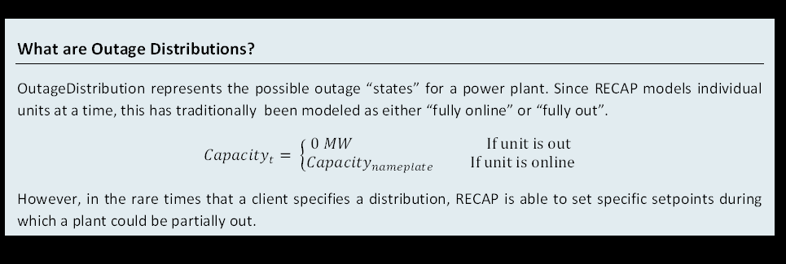

# [Stochastic Outages](<new_modeling_toolkit.system.outage_distribution>)

In Recap, OutageDistribution is represented by specifying the setpoints of the derate as a % of total MW and the
probability of the different setpoints.

Outage distribution functions are used to simulate the distribution of full or partial outages. Mean time to repair
characterizes the duration of outages. Outages are generated independently for each resource, then summed.



```{warning}
Tell Charlie to add documentation here.
```


