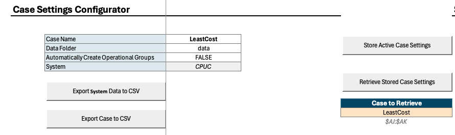
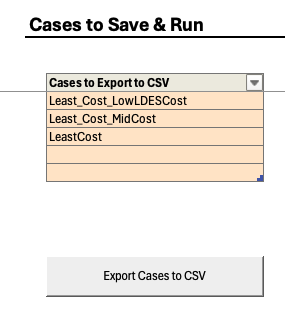

## Saving Input Data & Case Settings

Users who want to run pre-existing cases can save all necessary inputs from the “RESOLVE Case Setup” tab of the Scenario Tool.

|  |  |
|--------------------------------------------------------------------|--------------------------------------------------------------------|
| | |

Data is saved from RESOLVE Scenario Tool via the macros in the RESOLVE Case Setup worksheet.

1.  Save the System Data via the Export System Data to CSV macro button. This will take about 20 minutes for all the data in all tabs to be saved in the “data” folder. Running this macro is needed everything data updates are introduced to the Scenario Tool.

2.  Save a setup case by finding the case name from “Case to Retrieve” dropdown options, and run Retrieve Stored Case Settings via macro button. This will also set the “Case Name” to the specified case name and update the list of scenarios in the Case Settings Configurator list

3.  Next, by clicking on the Export Case to CSV macro button, you are able to save the case in your data directory and ready to setup your case run.

4.  Alternatively, go to Cases to Save & Run section and choose a list of cases interested in running and save all case settings via a single macro button of Export Cases to CSV.

