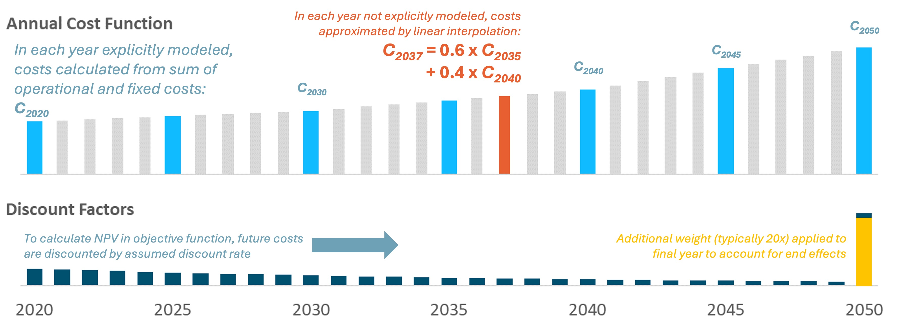
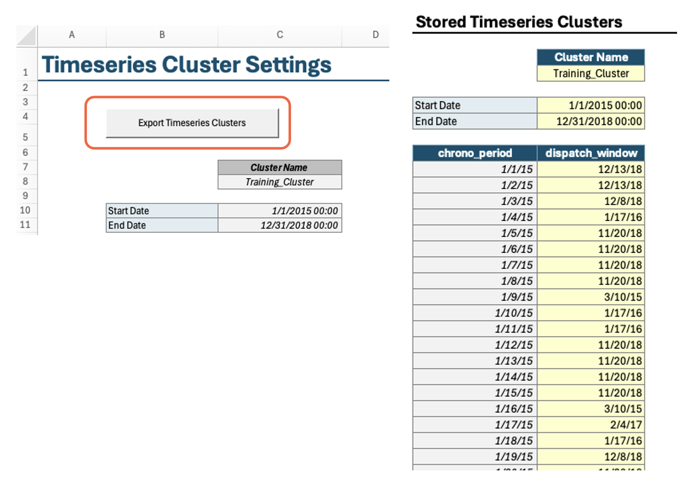
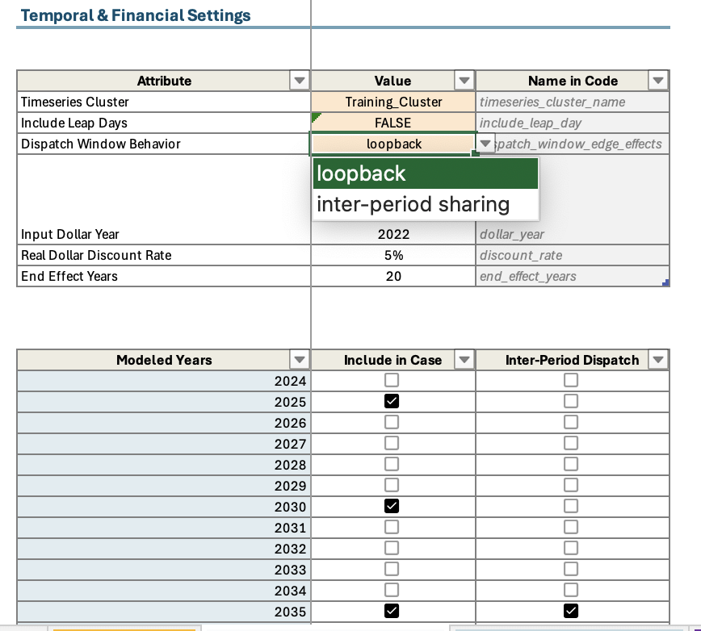

## Important Settings in Scenario Tool

### Financial Settings

RESOLVE optimizes net present value for the entire planning horizon. To do so, it relies on discount factors for selected modeled years. The model endogenously calculates the annual discount factors to use for each modeled year based on four pieces 
of information:
1. **Cost dollar year:** The dollar year that costs are input in and should be reported out in. In general, `RESOLVE` is designed 
to be in real dollars for a specific dollar year.
2. **Modeled years:** Which modeled years to include in the `RESOLVE` case.
3. **End-effect years:** The number of years to extrapolate out the last modeled year. In other words, considering 20 years 
of end effects after 2045 would mean that the last model year's annual discount factor would represent the discounted cost 
of 2045-2064, assuming that the 2045 costs are representative of a steady-state future for all end effect years.
4. **Annual discount rate:** Real discount rate in each year

The schematic below shows how net present value is being calculated based on costs in selected modeled years:


### Timeseries Data

Timeseries data representing profiles for loads and resources are stored in separate CSV files under the `./data/profiles/` subfolder to keep the Scenario 
Tool spreadsheet filesize manageable; however, the Scenario Tool contains the profile path associated with each resource parameter which point the code to the relevant CSV file. These CSVs must have the following format:

| timestamp                    | value             |
|------------------------------|-------------------|
| [timestamp (hour beginning)] | [attribute value] |
| ...                          | ...               |

Note that for any profile relying on historical data must have at least data for the representative day weather years. The profiles get rescaled in the code to ensure that representative day-based capacity factors for solar and wind match the historical timeseries average capacity factor value. The rescaled profiles are saved in the `./data/processed/resolve/rescaled_profiles`.  

### Representative Period Settings

The Timeseries Clusters worksheet in Scenario Tool contains the representative days and chronological periods covering selected weather years (typically 23 weather years in the CPUC IRP model are represented in 36 days). Note that RESOLVE representative days are created using RESOLVE Day Sampling Script provided in the RESOLVE package. 
In order to model inter-day sharing for storage to shift energy between days in a single modeled year, RESOLVE relies on chronological timeseries mapping with the representative days. 



### Temporal Settings
In Resolve Case Setup worksheet, you have the option to choose a set of representative day scenario (if more than one available) to include in your case run. Additionally, you can choose the years to model in RESOLVE, years to model with inter-day sharing. 
In order to include inter-day sharing, you need to choose "inter-period sharing" for dispatch window behavior; otherwise, choose "loopback" to exclude inter-day sharing. Additionally, choose the years that you wish to include inter-day sharing for. And lastly, choose a single weather year from the weather years list (all years have the same chronological mapping with representative days, so any single weather year can be chosen in this case).



## Scenario tagging functionality

See {ref}`input_scenarios` for discussion about how to determine which scenario tagged data is used in a specific model run. 

On most of the component & linkage attributes tabs, you will find a `Scenario` column. In the Scenario Tool, a single instance of 
a component can have **multiple** line entries in the corresponding data table as long as each line is tagged with a different scenario 
tag, as shown in the below screenshot. 

```{image} ../_images/resource-scenario-tags.png
:alt: Screenshot from Scenario Tool showing multiple scenario tags for the same resource.
:align: center
```

Scenario tags can be populated *sparsely*; in other words, every line entry for the same resource does not have to be fully populated 
across all columns in the data tables. In the example screenshot above, this is demonstrated by the `base` scenario tag having 
data for "Total (Planned + New) Resource Potential in Modeled Year (MW)" and no data for "All-In Fixed Cost by Vintage ($/kW-year)", 
whereas the scenario tags `2021_PSP_22_23_TPP` and `2021_PSP_22_23_TPP_High` are the reverse. 

The Scenario Tool will automatically create CSVs for all the data entered into the Scenario Tool. These CSVs have a 
four-column, "long" orientation.

| timestamp                            | attribute        | value   | scenario (optional) |
|--------------------------------------|------------------|---------|---------------------|
| [None or timestamp (hour beginning)] | [attribute name] | [value] | [scenario name]     |
| ...                                  | ...              | ...     | ...                 |


