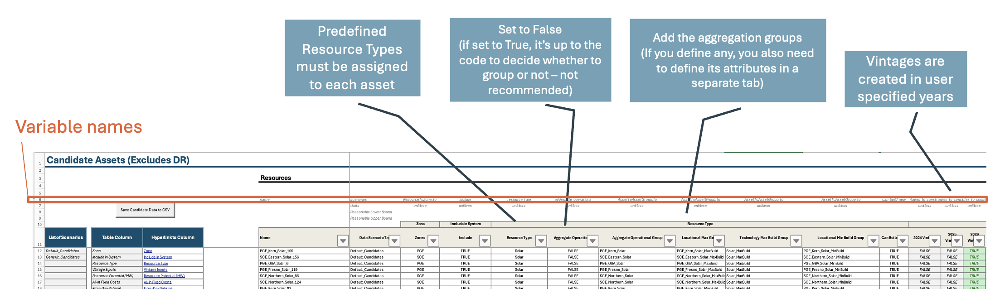

## General Tips for updating the Scenario Tool

It is recommended to first run an existing setup case in the Scenario Tool with no updates to the data to make sure the steps in the process of running RESOLVE is fully functional. Instructions are provided below.

Here are some general tips to have in mind when updating the Scenario Tool or setting up new cases:

1.  Avoid using very long component names.

2.  Row six in every worksheet includes the variable name used in the model backend associated with the variables. If a data column has no row six variable name, that means it will be saved in the data folder. Do not edit the name without checking the variable names in the backend.

3.  Row 10 is fully customizable and flexible for any user defined names and has no linkage to the data folder.

4.  Row 11 is generally flexible, and user-defined except for annual and monthly data that must start with the year or month, respectively.

5.  Most worksheets have small tables that list all existing scenarios on the worksheet, as well as a list of table column names and a hyperlink for easier navigation in large data tables. The links are useful to click on and jump to the related section of interest.

    

Example of a RESOLVE Candidate Assets Worksheet
