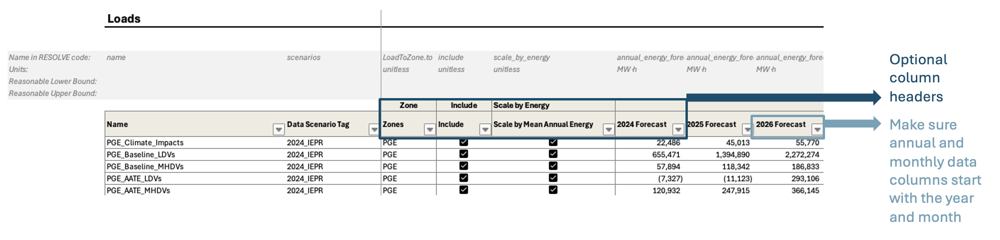

## Tips for updating Scenario Tool

It is recommended to first run an existing setup case in the Scenario Tool with no updates to the data to make sure the steps in the process of running RESOLVE is fully functional. Instructions are provided below.

Here are some general tips to have in mind when updating the Scenario Tool or setting up new cases:

1. Avoid using very long component names.

2. Ensure all component names are distinct in the Scenario Tool.

3. Be careful about editing table headers. In every worksheet, on top of component data, there is grey colored rows that include the variable name used in the model backend associated with each particular data column, units and may include reasonable upper and lower bounds.
 - If a data column has no variable name, that means data in that column will not get used in the model. 
 - Do not edit the name without checking the variable names in the backend.

4. Component table column names are generally flexible, and user-defined except for annual and monthly data that must start with the year or month, respectively.

5. Most worksheets have small tables on the very left side that list all existing scenarios on the worksheet, as well as a list of table column names and a hyperlink for easier navigation in large data tables. The links are useful to click on and jump to the related section of interest.

6. It is recommended to keep the format of the component names for new component additions to make sure they are compatible with downstream results viewer workbooks. 
 - For example, start load components with the zone name followed by load component name. Another example is fuel names which is recommended to use zone name, fuel name followed by "_Fuel". 

    

