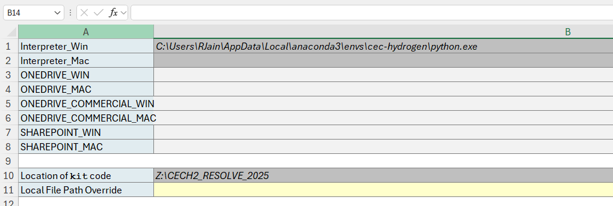
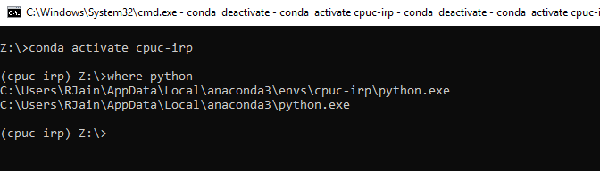
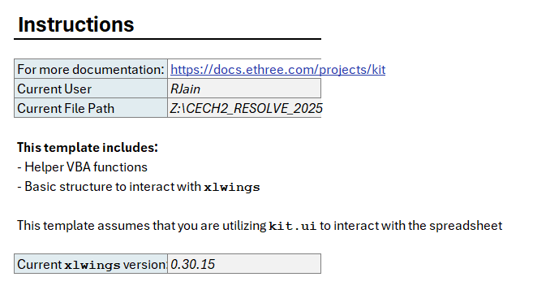
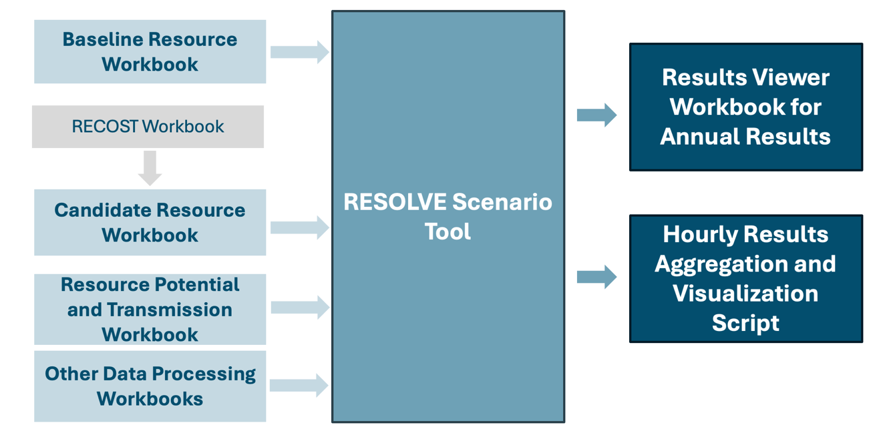

# RESOLVE Scenario Tool

The RESOLVE Scenario Tool is a user-centric model interface, designed to link data, inputs, assumptions, and constraints with the RESOLVE code. The primary step in being able to make that linkage is making sure that xlwings is correctly set-up.

## Configuring Xlwings

The RESOLVE Scenario Tool is a user-centric model interface, designed to link data, inputs, assumptions, and constraints with the RESOLVE code. The primary step in being able to make that linkage is making sure that xlwings is correctly set up.

As an initial step, make sure that the Scenario tool is in the directory of the kit folder. Next in the Scenario Tool head to the xlwings.conf tab, which should be towards the end. On cell B10, “Location of kit code” please input the appropriate file directory. Depending on your machine update the Python Path in Cell B1 or Cell B2. Keep everything else in this tab empty.

**Windows Excel Configure Python Path:**

1.  Open Command Prompt or PowerShell and activate the environment with the command `conda activate resolve-env`

2.  Type the command `where python` to see where the resolve-env version of Python is stored. This should look like:  
      
    `C:\Users\[username]\Anaconda3\envs\resolve-env\python.exe`   
      
    Paste this path into the **Python Path** cell.

:::{admonition} ⚠️**Warning**  
Make sure to use a backslash \\ (and not a forward slash /) on Windows for the Python path.
:::

**MacOS Excel Configure Python Path:**

1.  Open Terminal and activate the environment with the command `conda activate resolve-env`

2.  **First time setup only**: Run the command `xlwings runpython install`. You should see a prompt from macOS asking you for permission for Terminal to automate Excel. **You must allow this.**

3.  Type the command `which python` to see where the resolve-env version of Python is stored. This should look like:  
      
    `/Users/[username]/anaconda3/envs/resolve-env/bin/python`   
      
    Paste this path into the **Python Path** cell.

:::{admonition}⚠️**Warning**  
Make sure to use a forward slash / (and not a backslash \\) on macOS for the Python path.
:::

For example, if you are using windows, open the command terminal and activate the environment. In this instance, the environment is called cpuc-irp

Use the file path which has the environment name embedded in it.

Once this is done, please head to the Cover tab at the beginning of the Scenario Tool. If you have made the right updates and have installed the environment correctly, you should be able to recalculate the spreadsheet and notice that the Cells C22 & C23 are now filled up. In cell C31, you will have information on the xlwings version, make sure that this is v 0.30.15 or above.  
  
Your cover tab should look something like this:

Example of Cover Sheet Settings in Scenario Tool

With this, the initial set-up phase of the Scenario tool should be completed, and the user should be able to make changes/updates to the scenario tool and run cases.

## Overview of Data Organization in the Scenario Tool

The main data are organized in RESOLVE upstream workbooks, most importantly, the baseline, load and candidate resource workbooks that also have duplicates of the RESOLVE template tables for easy data transfer to the RESOLVE model. These workbooks are made available if CPUC desires, but the users should not need to interact and can directly rely on Scenario Tool for reviewing or using the data.

Illustration of data flow from upstream workbooks to RESOLVE Scenario Tool

## Structure & Tabs of the Scenario Tool

All CPUC RESOLVE Scenario Tools have the following main worksheets.

| **Scenario Tool Tab**         | **Short Description**                                                                                                                                                                                                                                                                                                       |
|-------------------------------|-----------------------------------------------------------------------------------------------------------------------------------------------------------------------------------------------------------------------------------------------------------------------------------------------------------------------------|
| Cover                         | Takes input for Python & Folder Path as defined by the user                                                                                                                                                                                                                                                                 |
| RESOLVE Case Setup            | A tab where users can look at existing case designs, make new cases, record them, save data inputs and case settings                                                                                                                                                                                                        |
| Timeseries Clusters           | Sample days represented in RESOLVE as well as chronological days representing inter-day sharing are included here                                                                                                                                                                                                           |
| Zonal Topology                | Zones, inter-zonal power flow paths, and path expansion options as well as simultaneous flow limits are defined                                                                                                                                                                                                             |
| Load Components               | Defines different load components and values for each zone                                                                                                                                                                                                                                                                  |
| Passthrough Inputs            | Gathers all inputs across multiple tabs that contain useful information to carry to RESOLVE case outputs                                                                                                                                                                                                                    |
| Fuels                         | Includes all defined fuels and their price and GHG and carbon price policy attributes                                                                                                                                                                                                                                       |
| Carbon Price                  | Includes carbon price scenarios                                                                                                                                                                                                                                                                                             |
| Emissions Policy              | Includes emissions target scenarios and policy adjustments                                                                                                                                                                                                                                                                  |
| Clean Energy Policy           | Includes clean energy targets for RPS and SB100 scenarios and policy adjustments at CAISO level                                                                                                                                                                                                                             |
| System Reliability            | Includes ELCCs, and system reliability target scenarios and adjustments at the CAISO level                                                                                                                                                                                                                                  |
| Baseline Resources - Default  | Includes all existing resources across all zones. Represents their cost and operational inputs as well as their policy attributes and memberships with asset groups. Additional worksheets with “Baseline” in the name include additional scenarios related to all or subset of Baseline resources.                         |
| Min Local Capacity Groups     | Include min operational capacity that has to be maintained in local areas aggregated at the IOU level                                                                                                                                                                                                                       |
| Candidate Resources - Default | Includes all candidate resources across all zones. Represents their cost and operational inputs as well as their policy attributes and memberships with operational group and asset groups. Additional worksheets with “Baseline” in the name include additional scenarios related to all or subset of Candidate resources. |
| Resource Dispatch Groups      | Includes details on operational groups. (A group of one or more resources that are similar operationally, are dispatched with their operational groups)                                                                                                                                                                     |
| Min Build Groups              | Includes all min build requirement for all or subset of candidate resources       |
| Max Build Groups              | Includes all max build requirement for all or subset of candidate resources   |
| Candidate Shed DR             | Includes Shed Dr candidate resource options and their attributes                                                                                                                                                                                                                                                            |
| Tx Constraints                | Includes CAISO transmission constraints such as existing headrooms for FCDS, SSN and EODS deliverability periods                                                                                                                                                                                                            |
| CAISO Tx Upgrades             | Includes candidate upgrades potential and costs to expand CAISO Tx constraints                                                                                                                                                                                                                                              |
| Tx Membership                 | Includes CAISO transmission memberships with resources and transmission upgrades with FCDS, SSN and EODS deliverability coefficients                                                                                                                                                                                        |
| Lists                         | Includes dropdown options defined in the workbook                                                                                                                                                                                                                                                                           |
| Scenarios                     | Includes all scenarios within all worksheets                                                                                                                                                                                                                                                                                |
| xlwings.conf                  | Includes paths to user’s RESOLVE `python` link and `kit` folder directory                                                                                                                                                                                                                                                   |

Additional details are also covered in the FAQ section. Comprehensive information on the key inputs and assumptions present in the Scenario Tool can be found in the [Inputs & Assumptions document](https://www.cpuc.ca.gov/-/media/cpuc-website/divisions/energy-division/documents/integrated-resource-plan-and-long-term-procurement-plan-irp-ltpp/2024-2026-irp-cycle-events-and-materials/draft-2025-inputs-and-assumptions-document.pdf) released by the CPUC. For users planning on comprehensively using the Model, a thorough reading of the I&A document is recommended.
