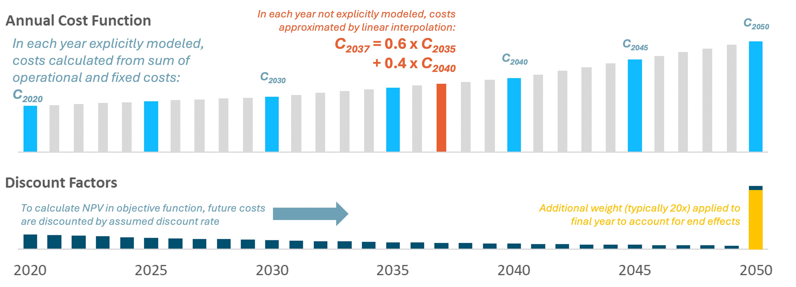
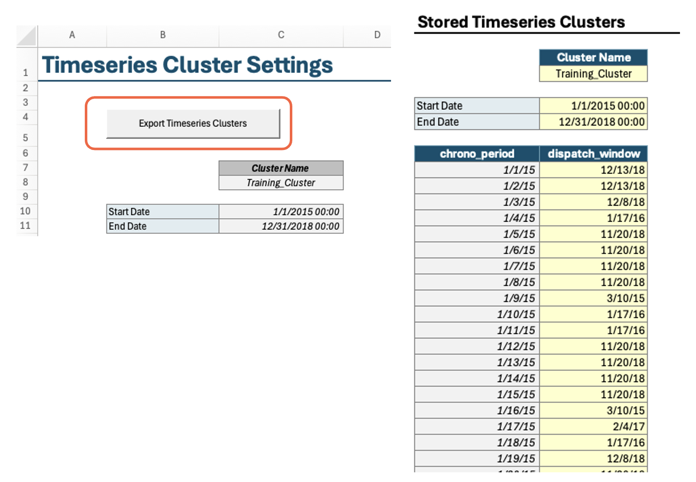
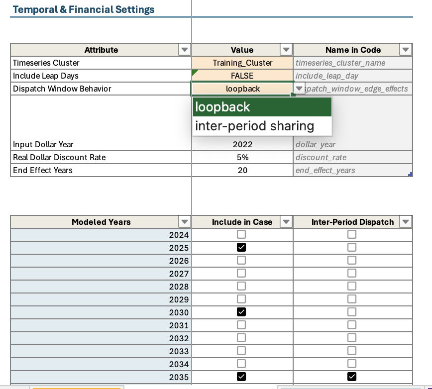

## Important Settings in Scenario Tool

### Financial Settings

RESOLVE optimizes net present value for the entire planning horizon. To do so, it relies on discount factors for selected modeled years. The model endogenously calculates the annual discount factors to use for each modeled year based on four pieces 
of information:
1. **Cost dollar year:** The dollar year that costs are input in and should be reported out in. In general, `RESOLVE` is designed to be in real dollars for a specific dollar year. In this cycle, all cost inputs and reporting is in 2024 dollar year.
2. **Modeled years:** Which modeled years to include in the `RESOLVE` case.
3. **End-effect years:** The number of years to extrapolate out the last modeled year. In other words, considering 20 years 
of end effects after 2045 would mean that the last model year's annual discount factor would represent the discounted cost 
of 2045-2064, assuming that the 2045 costs are representative of a steady-state future for all end effect years.
4. **Annual discount rate:** Real discount rate in each year

The schematic below shows how net present value is being calculated based on costs in selected modeled years:

### Timeseries Data

Timeseries data representing profiles for loads and resources are stored in separate CSV files under the `./data/profiles/` subfolder to keep the Scenario 
Tool spreadsheet filesize manageable; however, the Scenario Tool contains the profile path associated with each resource parameter which point the code to the relevant CSV file. These CSVs must have the following format:

| timestamp                    | value             |
|------------------------------|-------------------|
| [timestamp (hour beginning)] | [attribute value] |
| ...                          | ...               |

Note that for any profile relying on historical data must have at least data for the representative day weather years. The profiles get rescaled in the code to ensure that representative day-based capacity factors for solar and wind match the historical timeseries average capacity factor value. The rescaled profiles are saved in the `./data/processed/resolve/rescaled_profiles`.  

### Representative Period Settings

The Timeseries Clusters worksheet in Scenario Tool contains the representative days (dispatch windows) and chronological periods covering selected weather years (typically 23 weather years in the CPUC IRP model are represented in 36 days). Note that RESOLVE representative days are created using RESOLVE Day Sampling Script available in the Github RESOLVE repository. 

In order to model inter-day sharing for storage to shift energy between days in a single modeled year, RESOLVE relies on chronological timeseries mapping with the representative days; thus both chronological timeseries and representative days are inputs to the Scenario Tool. There is an option to run the macro available in this tab of the Scenario Tool that allows you to save the timeseries cluster settings independent from other data from the Scenario Tool; otherwise, the data will be saved along with the case settings when you run the **Export Case to CSV** macro from "RESOLVE Case Setup".

### Temporal Settings
In RESOLVE Case Setup worksheet, you have the option to choose a set of representative days (if more than one available) to include in your case run. Additionally, you can choose which years to model in RESOLVE, and which years to model with inter-day sharing feature. 

In order to include inter-day sharing, you need to choose "inter-period sharing" for dispatch window behavior; otherwise, choose "loopback" to exclude inter-day sharing. Additionally, choose the years that you wish to include inter-day sharing for. And lastly, choose a single weather year from the weather years list from the last table in RESOLVE Case Setup worksheet (all years have the same chronological mapping with representative days, so any single weather year can be chosen in this case).

### Scenario tagging functionality

A Data Scenario Tag is a tag that you may use to refer to one or a group of components when setting up a new scenario. These user-defined tags are a way to make case setup more intuitive and to provide flexibility around grouping data across multiple tabs when relevant. For example, you may use one data scenario tag for all California load components that are driven from IEPR of a specific vintage. You can also use the same scenario tag if you like for Customer_PV resources in the Baseline workbook. It is also notable that “Base” refers to default assumptions that typically are included in all case runs and are not expected to change across cases. When setting up your case on the RESOLVE Case Setup tab, you can select which Scenario Tags are used in the case with the Data Scenarios table (see next FAQ).

Each case in RESOLVE is defined by its list of scenario tags that are flagged as TRUE to be included in the modeling. Each Scenario Tag has an associated priority number (high number means higher priority) which allows you to define and include more than one scenario for each component type with the higher priority scenario carrying the ultimate information to be used in the case run. For example, if you have one Scenario Tag that covers the default candidate resource assumptions, but you wish to model a high-cost scenario only for wind resources, you should include the high-cost wind Scenario Tag in the list and make sure it has higher priority number compared to the default scenario. Additional inputs include specifying solver options (optional), results reporting settings (e.g., if you wish to include hourly results reporting or not), temporal and financial settings, as well as selected modeling years with the years to include for inter-period sharing.

