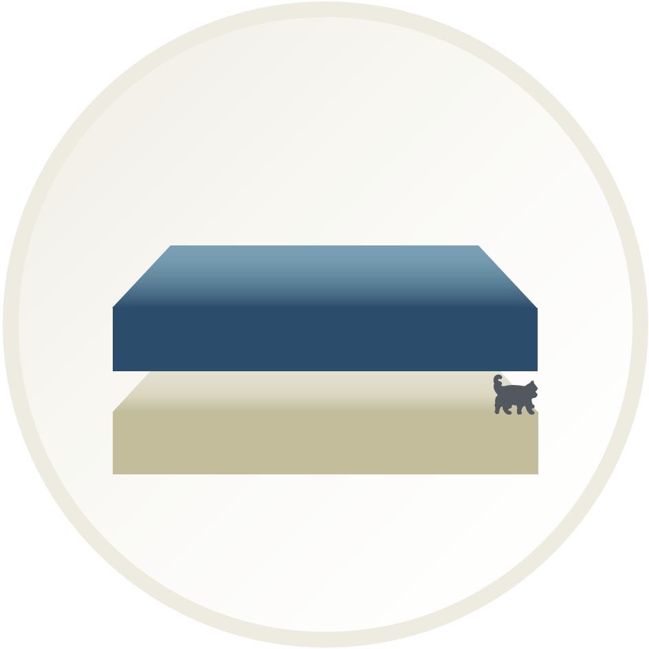

[](https://github.com/e3-/new-modeling-toolkit/actions/workflows/bump-version.yml)
[](https://github.com/e3-/new-modeling-toolkit/actions/workflows/ci.yml)
[](https://github.com/e3-/new-modeling-toolkit/actions/workflows/pre-commit.yml)

# Kit

<picture>
  <source media="(prefers-color-scheme: dark)" srcset="./docs/source/_static/logos/kit-dark.svg">
  <source media="(prefers-color-scheme: light)" srcset="./docs/source/_static/logos/kit-light.svg">
  
</picture>

Kit is a Python framework for modeling energy systems, with a current focus on the electricity sector. It provides a comprehensive set of tools and libraries for energy system analysis, including modules for RECAP and RESOLVE models.

## Features

- Common library of class definitions for energy systems data analysis
- Support for various energy components (Fuel, LoadComponent, Resources, etc.)
- Time series data handling with validation and sampling capabilities
- Visualization tools for exploratory analysis and results
- Integration with optimization solvers (via Pyomo)

## Getting Started

### Prerequisites

- Python 3.10 or higher
- Conda or Miniconda
- Gurobi (for optimization capabilities)

### Development Setup

1. Clone the repository:
   ```bash
   git clone git@github.com:e3-/kit.git
   cd kit
   ```

2. Create and activate the development environment:
   ```bash
   conda env create -f environment-dev.yml
   conda activate kit-dev
   ```

3. Install pre-commit hooks:
   ```bash
   pre-commit install
   ```

### Running Tests

Tests are written using pytest and can be run with:
```bash
pytest
```

## Documentation

The project documentation is built using Sphinx and is hosted on [ReadTheDocs](https://docs.ethree.com/projects/kit/en/main/). You will need to sign in with you Willdan SSO id.

To build the documentation locally:
```bash
cd docs
make html
```

Project Organization
------------

```nohighlight
├── LICENSE
├── README.md               <- The top-level README for developers using this project.
├── data
│   ├── external            <- Data from third party sources.
│   ├── interim             <- Intermediate data that has been transformed.
│   ├── processed           <- The final, canonical data sets for modeling.
│   ├── raw                 <- The original, immutable data dump.
│   └── settings            <- Model settings, potentially scenarios as subfolders.
│
├── docs                    <- A default Sphinx project; see sphinx-doc.org for details
│
├── new_modeling_toolkit    <- Source code for use in this project.
│   ├── common              <- Common library of class definitions, methods for structuring energy systems data for analysis.
│   │   ├── fuel            <- `Fuel` class definition.
│   │   ├── load_component  <- `LoadComponent` class definition.
│   │   ├── price_stream    <- `PriceStream` class definition.
│   │   ├── reserve         <- `ReserveRequirement` class definition.
│   │   ├── resource        <- `Resource` class definition.
│   │   ├── timeseries      <- `Timeseries` class definition, including methods for validating, down-, and up-sampling timeseries data.
│   │   └── zone            <- `Zone` class definition.
│   │
│   ├── recap               <- RECAP model modules, leveraging `common` library
│   ├── resolve             <- RESOLVE model modules, leveraging `common` library
│   ├── tests               <- Folder with `pytest` tests, as we want to tests to be accessible for users who import to toolkit
│   └── visualization       <- Scripts to create exploratory and results oriented visualizations
│
├── notebooks               <- Jupyter notebooks. Naming convention is a number (for ordering),
│                              the creator's initials, and a short `-` delimited description, e.g.
│                             `1.0-jqp-initial-data-exploration`.
│
├── pyproject.toml          <- [Consider adding a pyproject.toml file at release.]
│
├── references              <- Data dictionaries, manuals, and all other explanatory materials.
│
├── reports                 <- Generated analysis as HTML, PDF, LaTeX, etc.
│   └── figures             <- Generated graphics and figures to be used in reporting
│
└── setup.py                <- Make this project pip installable with `pip install -e`
```
