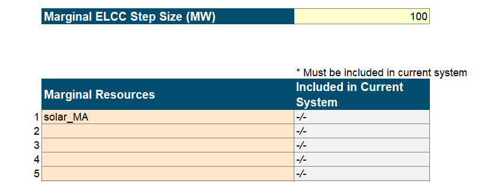
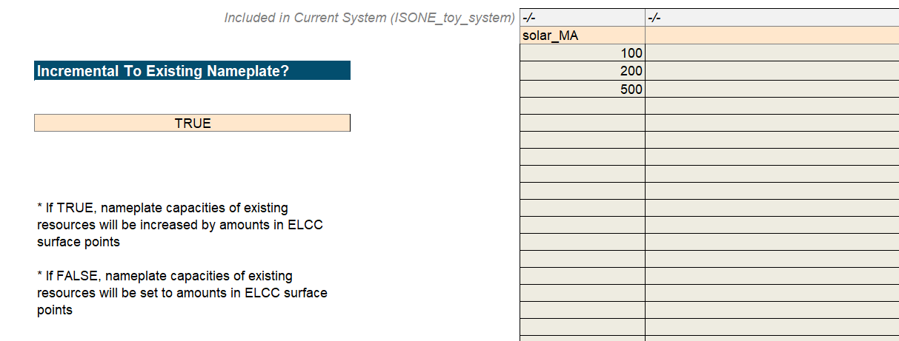

# 🏃‍♀️ Toy Model: How-tos and Homeworks

```{article-info}
:date: Sept 11, 2024
:read-time: 60 min read
:class-container: sd-p-2 sd-outline-muted sd-rounded-1
```

##  Quick Start Guide

In this section, we will provide a high-level guidance of the Recap workflow that users should go through to set up and
run different kinds of Recap cases. 
<br>
<br>

### 💻 Navigate the UI

<div style='padding:0.1em; background-color:#E9D8FD; color:#69337A'>
<span>
<p style='margin-top:1em;margin-left:1em; text-align:auto'>The toy/template UI that will be used for all examples is: <b>“./Recap-Resolve Scenario Tool.xlsm”. </b> <br> This UI is pre-populated with data for a toy ISO New England system.</p>
</span>
</div>
<br>

(recap/example-1)=


:::::{dropdown} 🏃 Example 1: Run a Single Recap Run
:class-title: sd-fs-6

💭 **the takeaway:** *here you will learn how to run a simple base case in Recap and then check the reliability of the
toy system in the short term, e.g., 2030.*
<br>

1. **Define and save [System](../system/index.md):** In the “<span style="color:white;background-color:#034E6E">
   System</span>” tab, define all the [Components](../core/components.md) of the system (pre-populated in the example
   UI), then <u>click on the “1. Save System Configuration” button to save it</u>. You will need to assign a name in row
   4 to this user-defined system before saving.

::::{dropdown} What’s happening here?
   > <font color='#595959'>***What’s happening here?***</font>
   >
   > This macro will record the entries in this tab in a specific format, create necessary CSV files for executing the
   model, and save them in the project folder.
   >
   > Those System inputs are saved here: `“./data/interim/systems/[YourAssignedSystemName]”`.

::::

<br>

2. **Define and save [Components](../core/components.md):** Each worksheet after
   the “<span style="background-color:#008A37">Components →</span>” tab defines elements of a potential system. Set up
   respective elements of the component (pre-populated in the example UI) in each worksheet and then <u>click VBA button
   “2. Save Component Data for Model”</u> in the “<span style="background-color:#008A37">Components →</span>” tab to set
   up components. `Model Name` should be set to `Recap` as well.

::::{dropdown} What’s happening here?
   > <font color='#595959'>***What’s happening here?***</font>
   >
   > This macro will read and re-format the data in each worksheet, then save them as csv files in the project folder.
   >
   > You shall see each tab saved as a folder here: `“./data/interim/”`.
   > <br>
   > You shall also see Linkages between components created in `“./data/interim/linkages”`.
   
::::
   
<br>

3. **Create your Case:** Navigate to “<span style="background-color:#C4BD97">Recap Case Settings</span>” tab and fill in
   calculation settings of the case to run (pre-populated in the example UI). This run is aiming at calculating system
   reliability w/o tuning, so <u>flip “calculate_reliability” to be `TRUE`</u>. No need to modify other input settings.
   You can then assign a “Case Name”, e.g. “Base_Case_run”, and <u>press “Save Case Settings” button</u> to save your
   defined case.

::::{dropdown} What’s happening here?

   > <font color='#595959'>***What’s happening here?***</font>
   >
   > All case settings are stored under the folder `“./data/settings/Recap”`. Each time a case is created, a sub-folder
   will the case name will be created in the master Recap folder.
   >
   > You shall track case-specific calculation settings saved in each sub-folder.

::::

<br>

4. **Refresh the case list:** Now in the “<span style="background-color:#C4BD97">Case Dashboard</span>” tab, <u>click
   VBA button “Update List of Saved Cases”</u> to refresh the full list of saved cases from the “Recap Case Settings”
   tab. This allows you to see which cases are available.  
   <br>


5. **Choose the case and execute the model:** Click the cell that contains the correct case and <u>press “Run Recap
   Cases” button</u> to run the selected case. This will initiate a separate Command Prompt window showing the progress
   of the model.

::::{dropdown} can I execute the model from the command line?What’s happening here?

   > <font color='#8AAC46'>***can I execute the model from the command line?***</font>
   >
   > Recap 3.0 can also be run from the command line! This can be useful if the UI macros are giving you trouble.
   >
   > To run Recap from a command line, open a Command Prompt (or another terminal app, like PowerShell) in
   the `“./kit/Recap/”` folder and activate the environment using the following
   command: `conda activate [environment-name]` (per the setup example above: `conda activate nve-Recap-kit`). Then use
   the following command to run the case: `python run_model.py`.
   >
   > To specify which case you’re running, update the `cases_to_run.csv` within the `“./data/settings/Recap/”` folder.
   Users now only have the choice to run one single case, the developer team is working on speeding modeling up to run a
   batch of cases in parallel.

::::

<br>

6. **View results:** For this test case, you should expect the model to finish in about 2 minutes. After the case is
   completed, navigate to `"/reports/Recap/"` folder and find the right sub-folder for the case you just ran. Within the
   case folder, check out system reliability metrics in the `“reliability_results.csv”` file. <font color='#034E6E'>The
   LOLE result should be roughly 19.01/yr.</font>  
   <br>

:::::


:::::{dropdown} 🏃 Example 2: Run a Marginal ELCC Case
:class-title: sd-fs-6

### 🏃 Example 2: Run a Marginal ELCC Case

💭 **the takeaway:** *here you will learn how to calculate a resource's marginal ELCC in Recap*

1. **Determine the base case:** Make sure you have a base case defined & have respective System and Components created.
   This will be the base case portfolio relative to which the ELCC cases become marginal. If you’re starting from a
   blank UI, set up the base case following the procedure in [Example 1](#recap/example-1).  
   <br>


2. **Select the resource and decide step size:** Pick one existing resource in the portfolio, then <u>add it into the
   “Marginal Resources” table</u> in the “<span style="background-color:#C4BD97">Recap Case Settings</span>” tab. In the
   “Marginal ELCC Step Size (MW)” cell above, <u>define the incremental capacity</u> added to the resource relative to
   base case. In this guiding example, calculate marginal ELCC for additional 100 MW tranche of “solar_MA”.


<br>

3. **Save the new case and execute the model:** To use the marginal ELCC functionality in Recap 3.0, <u>flip
   “calculate_marginal_ELCC” to `TRUE`</u> in the Recap Case Settings table. Since ELCC is calculated as the difference
   of capacity short / deficit between the base case and marginal case, you also need to <u>flip
   “calculate_perfect_capacity_shortfall” to `TRUE`</u> to initiate the calculation of base case capacity short. Next,
   assign a name and save the new case by <u>pressing “Save Case Settings” VBA button</u>, then follow step 4 & step 5
   in [Example 1](#recap/example-1) to write and run the case.

::::{dropdown} Note on saving a new case

```{note}
Note that saving a new case involves no system components or linkages updates. 
At any time the user wishes to define new components or modify attributes of a specific component, it is required to click “1. Save System Configuration” and “2. Save Component Data for Model” button again.
```

::::

::::{dropdown} Note on saving a new case

> <font color='#595959'>***What’s happening here?***</font>
>
> Upon saving the case, you shall see a new sub-folder created here with the case
> settings: `“./data/settings/Recap/custom_ELCC_surface.csv”`.
> <br>
> It is important for user to confirm that these calculation settings are set appropriately for specific use-case, so it
> is recommended for user to compare this sub-folder with that of the base case (from [Example 1](#recap/example-1)) to
> see how case settings have changed in a marginal ELCC case run.
>
> You shall find the two differences exist in `“./ELCC_surfaces/marginal_ELCC.csv”` and `“./case_settings.csv”`.

::::

<br>


4. **View results:**  For this test ELCC case, you should expect the model to finish in about 5 minutes. After the case
   is completed, navigate to `"./reports/Recap/"` folder and find the right sub-folder for the marginal ELCC case.
   Within the case folder, check out marginal ELCC result for “solar_MA” in the `“ELCC_results.csv”`
   file. <font color='#034E6E'>The ELCC should be roughly 53 MW.</font>

```{note}
   Note that ELCC can be found IN the result csv file (column `incremental_ELCC`), which is the difference in capacity shortfall/surplus of the base case (column `base_case_perfect_capacity_shortfall`) and marginal case (column `perfect_capacity_shortfall`). 
```

<br>

:::::

:::::{dropdown} 🏃 Example 3: Run an ELCC Surface Case
:class-title: sd-fs-6

### 🏃 Example 3: Run an ELCC Surface Case

1. **Determine the base portfolio:** Make sure you have a base portfolio defined & have respective System and Components
   created. This will be the base relative to which the ELCC surface become marginal. If you’re starting from a blank
   UI, set up the base case following the procedure in [Example 1](#recap/example-1).

```{note}
   Any ELCC curve or surface must use a resource, or set of resources, included in the system.
   If you want to use a new resource, first define it in the system with 0 capacity as an initial input.
```

<br>

2. **Define the ELCC surface:** Scroll down to the bottom of “<span style="background-color:#C4BD97">Recap Case
   Settings</span>” tab to <u>define ELCC surfaces</u>. Select the resource that constitute the ELCC curve (2-D) or
   surface (3-D), and then put the resource name in row 107. In this example, we will use the same resource and create a
   2-D ELCC curve for "solar_MA" (see table below). Decide the penetration level at each surface point and then <u>
   flip "Incremental To Existing Nameplate?" to be `TRUE`</u>.


<br>

3. **Save the new case and execute the model:** To use the ELCC Surface functionality in Recap 3.0, <u>flip
   “calculate_ELCC_surface” to `TRUE`</u> in the “Recap case Settings” table. Save the new case by <u>pressing “Save
   Case Settings” VBA button</u>, then follow step 4 & step 5 in [Example 1](#recap/example-1) to write and run the
   case.


::::{dropdown} What's happening here?

   > <font color='#595959'>***What’s happening here?***</font>
   >
   > Upon saving the case, you shall see a new sub-folder created here with the case
   settings: `“./data/settings/Recap/[YourAssignedElccSurfaceCaseName]”`.
   > <br>
   > It is also recommended for user to compare this sub-folder with that of the base case (
   from [Example 1](#recap/example-1)). Similar to the marginal ELCC case, you shall find two differences exist
   in `“./ELCC_surfaces/”` folder and `“./case_settings.csv”`.
   
::::

<br>

4. **View results:** For this test ELCC surface case, you should expect the model to finish in approx. 6 minutes. After
   the case is completed, navigate to `"./reports/Recap/"` folder and find the right sub-folder for the ELCC surface
   case. Within the case folder, check out ELCC results for tranches of “solar_MA” resource. The file should be named as
   the `"custom_elcc_surface_ELCC_results.csv”`. 


:::::
