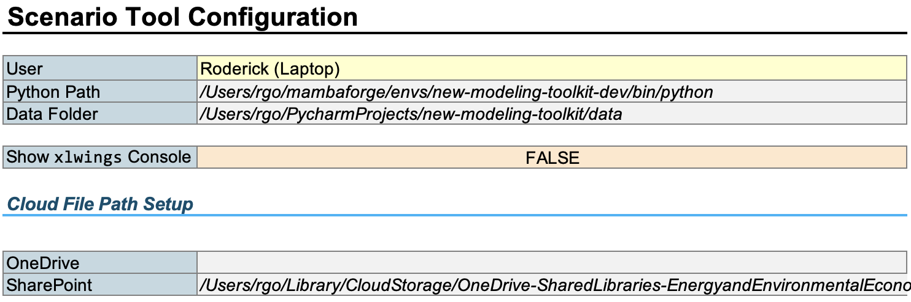
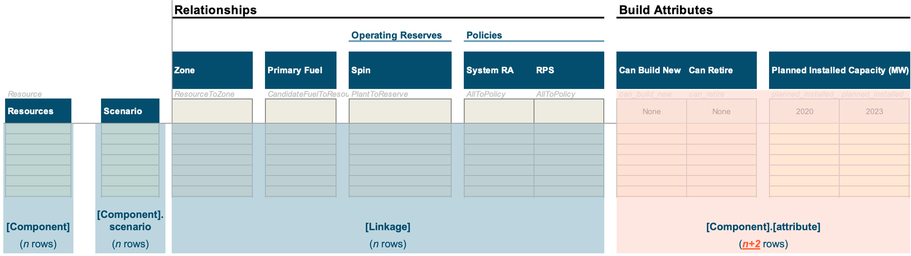
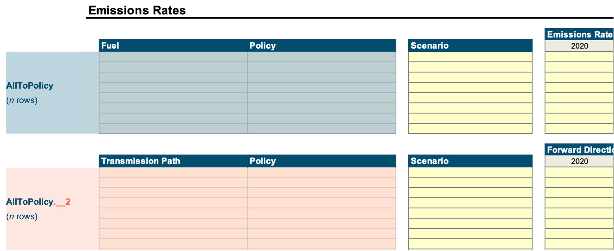

# Inputs Spreadsheets

Tools based on ``kit`` are intended to share common ``xlwings`` functionality to make developing & maintaining
spreadsheet input tools more consistent.

## Cover & Configuration

On the `Cover & Configuration` sheet, users can specify the requisite path information to enable `xlwings` to operate
properly. See example screenshot below:

{w=75%}

The main inputs are:

- **Python Path:** The path to the `new-modeling-toolkit` environment's Python executable (
  see [conda docs for help](https://docs.anaconda.com/free/anaconda/configurations/python-path/)):
    - **On Windows:** This should look something like `C:\Users\[username]\AppData\Local\anaconda3\envs\kit\python.exe`
    - **On macOS:** This should look something like `/Users/[username]/anaconda3/envs/kit/bin/python`
- **Data Folder:** The "destination" data folder where the data coming out of the Scenario Tool should be saved to.
- **(Optional) OneDrive, SharePoint:** `xlwings` on Onedrive/SharePoint
  is [a bit funky](https://docs.xlwings.org/en/stable/onedrive_sharepoint.html), but it does work if configured
  correctly. If the Scenario Tool is saved to OneDrive or SharePoint, you need to:
    1. Sync the OneDrive/SharePoint
       folder [to your computer](https://support.microsoft.com/en-us/office/sync-sharepoint-files-and-folders-87a96948-4dd7-43e4-aca1-53f3e18bea9b#OSVer=Windows)
        - You may need to set the folder as "Always Keep On Device" for the `xlwings` to work propertly (your mileage
          may vary)
    2. On the `Cover & Configuration` sheet, specify the **local** path to the OneDrive/SharePoint folder/sub-folder
       that contains the Scenario Tool.
        - **On Windows:** This should look something
          like `C:\Users\[username]\OneDrive...\[project folder]/[subfolders]`
        - **On macOS:** This should look something
          like `/Users/[username]/Library/CloudStorage/OneDrive.../[project folder]/[subfolders]`

For convenience, there is a simple `INDEX/MATCH` formula set up to save different users' configurations, since each *
*machine**
may be configured slightly differently.

### `xlwings.conf`

The `xlwings` code actually reads a hidden sheet named `xlwings.conf`. This sheet is formula-linked to the Cover &
Configuration sheet and users generally shouldn't need to update this.

## Updating Available `Components` & `Linkages`

Named ranges are the key to how `System` data in the Senario Tool works. At a high-level, the `xlwings` code is
mapping 
named ranges in the Scenario Tool to known `Component` names, `Linkage` names, and the names of associated data fields.

{w=75%}

At this time, linkages and component attributes have slightly different "schemas" for how the named ranges are expected
to be configured for the `xlwings` code to read them correctly. For a component with `n` rows of data, you must ensure:

- The corresponding (optional, though strongly suggested) `scenario` named range is also exactly `n` rows
- The component attribute named ranges are **`n+2`** rows, with the two extra rows being assumed to be header rows that:
    - (1) The name of the attribute
    - (2) A timestamp, None (blank is interpreted as `None`). In the Scenario Tool, the timestamps are custom-styled to
      look like years only, but they are actually full datetimes
- Linkage named ranges should be `n` rows and can be configured in one of three ways:
    - `BooleanColumn`: A (set of) column(s) where the value is a Boolean True/False
      (see "Spin" reserves as an example in the screenshot above). Rows that are `True` will be turned into linkages
      listed in `linkages.csv`
    - `NameColumn`: A (set of) column(s) where the value is the **name** of the linked compoent
      (see "Primary Fuel" as an example in the screenshot above). Rows with blanks will not be included
      in `linkages.csv`.
    - `TupleColumn`: A **pair** of columns that are already in the order of that the linkages should appear
      in `linkages.csv`.

Because sub-classes reuse attribute names (e.g., all subclasses of `Asset` have the attribute `can_build_new`), the Name
Manager will show that there are many copies of "duplicate" named ranges with worksheet-specific scopes.
**This is intentional**, and if you need to add a new component and reuse an attribute name, you will need to set it to
have a "Sheet"-only (instead of "Workbook") scope so that there aren't name conflicts.

### Organizing multiple tables of the same `Component` on the same sheet

In certain situations, you'll want to be able to separate the data for a component into multiple tables. For example,
you may want to visually distinguish (a) generator emissions rates from (b) emissions import rates assigned to
transmission paths.

In this situation, you will need to append a **suffix** to your attribute to avoid name collisions, and the code expects
the suffix to be a `.__[numeral]` (e.g., `AllToPolicy.multiplier.__2`).

### Updating "Components" tables on the `Lists` sheet

At the far right of the `Lists` sheet, there is a table that controls what components the Scenario Tool expects to save
out.

- **Tab:** The sheet in which the component appears. Note: Components can appear on multiple sheets, and sheets can
  contain multiple components.
- **`kit` Module:** The `kit` module path (e.g., `new_modeling_toolkit.common.fuel)
- **Component Class:** The `kit` class name (e.g., `CandidateFuel`)
- **Save Path:** The relative path from the `data/interim/` folder to save the component to
  (e.g., `assets` will save all assets to `data/interim/asset/` subfolder). This is a hard-coded attribute of `kit`
  classes, so look at `system.py` to find the correct path.
- **Fully-Specified Attributes:** "Fully-specified" means that the attribute named range includes

### Updating "Linkages" tables on the `Lists` sheet

At the far right of the `Lists` sheet, there is a table that controls what linkages the Scenario Tool expects to save
out.

- **Tab:** Name of sheet where to find the linkage named range
- **Linkage:** The name of the linkage class
- **Named Range:** The name of the named range where to find the linkage named range
- **Type:** There are 3 "types" of ways that the Scenario Tool is set up to interpret
  linkages (`BooleanColumn`, `NameColumn`, `TupleColumn`)
- **Scenario Column:** The named range for the scenario tags to attach to the linkages.
- **Other Column Name:** If using `BooleanColumn` or `NameColumn` the name of the other column to attach to the linkage
  (e.g., "Resources" in the screenshot above)
- **Other Column First:** Linkages are **directional**, so the order in which the "from" and "to" component appear
  matters. If using `BooleanColumn` or `NameColumn`, "Other Column First" controls whether the "other" column is the "
  from" (
  first) component.

{w=75%}

## Model Settings

Model settings logic more ad-hoc, since the standard `kit` model settings format only covers a few things:

- `attributes.csv`: There should be a named range called `settings_system`

  | attribute | value                    |
  |-----------|--------------------------|
  | system    | [`System` instance name] |

- `scenarios.csv`: There should be a name range called `settings_scenarios` that is simply a 1D list of scenario tags
  (with a header cell called "scenario").

The `xlwings` code to save these common model settings are saved in `new_modeling_toolkit/ui/scenario_tool.py`

### `Recap`-specific Model Settings

### `Resolve`-specific Model Settings

##### Temporal Settings

##### Custom Constraints

## Dropdown List Validations

# Results Reporting

